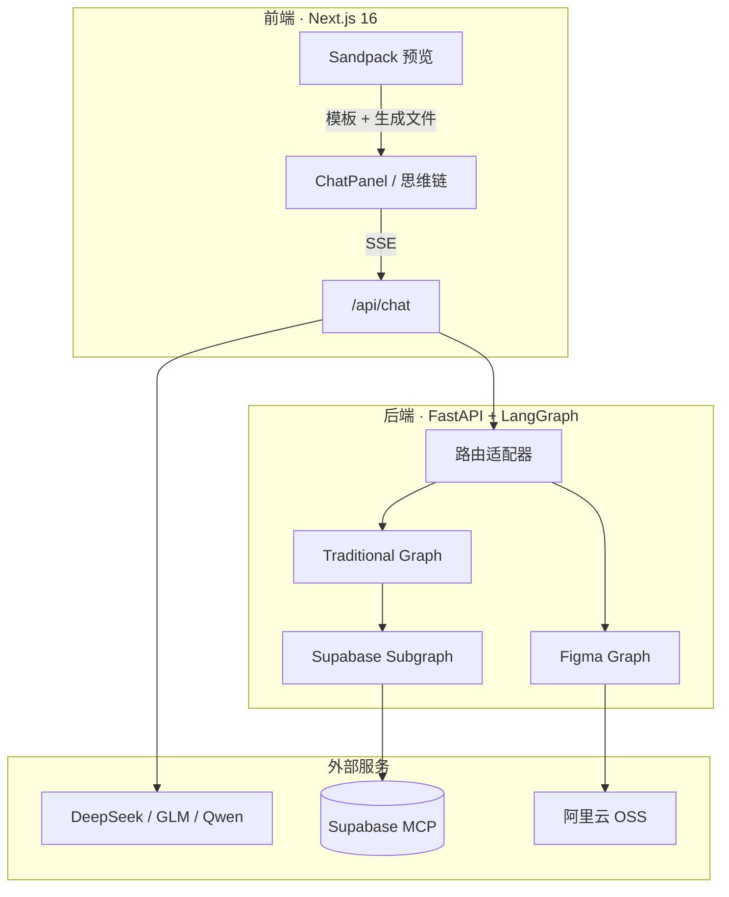

# Zood Figma Make

**用自然语言生成可运行的 React 应用** — LangGraph 多节点流水线 + Sandpack 实时预览 + Supabase / Figma 可选集成。

在线体验：[coding.zood.work](https://coding.zood.work/) · API：[coding-agent.zood.work](https://coding-agent.zood.work/)

---

## 这是什么

Zood Figma Make 是一个 **AI Coding Agent 全栈 Demo / 教学工程**：你在聊天框描述需求，后端通过 LangGraph 编排多步生成（分析 → 架构 → 组件 → 组装 → 编译校验），前端用 Sandpack 在浏览器里即时预览 Vite + React + TypeScript 项目。

支持三条生成路径：

| 路径 | 触发方式 | 说明 |
|------|----------|------|
| **Traditional** | 自然语言 / 图片 | 19 节点串行流水线，适合从 0 生成完整应用 |
| **Modification** | 在已有代码上继续改 | 携带 Sandpack 文件上下文迭代 |
| **Figma**（可选） | 粘贴 Figma 链接 | MCP 拉取设计稿再拆解重构（需配置 Figma OAuth） |

数据库场景可一键 **Supabase MCP 授权**，Agent 自动判断是否需要联库、探查 schema、执行 SQL。

---

## 架构一览



**数据流：** 用户输入 → `POST /api/chat/`（SSE）→ 节点逐步推送 `analysis` / `component` / `files` 等事件 → 前端合并进 Sandpack → 浏览器内 Vite 热更新预览。

---

## 技术栈

| 层级 | 选型 |
|------|------|
| 前端 | Next.js 16、React 19、Sandpack、Zustand、Tailwind CSS 4 |
| 后端 | FastAPI、LangGraph、Pydantic v2、sse-starlette |
| 模型 | DeepSeek / 智谱 GLM / 通义 Qwen（`MAIN_MODEL_PROVIDER` 切换） |
| 集成 | Supabase MCP、Figma Remote MCP、阿里云 OSS |
| 工具链 | uv（Python）、Bun（前端）、GitHub Actions（后端部署）、Vercel（前端） |

---

## 快速开始

### 环境要求

- Node.js 20+ / Bun
- Python 3.11+
- [uv](https://docs.astral.sh/uv/)（Python 包管理）

### 1. 克隆仓库

```bash
git clone https://github.com/zhuzaiBro/coding-agent-lesson.git
cd coding-agent-lesson
```

### 2. 启动后端

```bash
cd 完整代码/figma-make/server
cp .env.example .env
# 编辑 .env，至少填写 DEEPSEEK_API_KEY（或 GLM / Qwen）

uv sync
uv run uvicorn main:app --host 0.0.0.0 --port 7001 --reload
```

验证：访问 [http://localhost:7001](http://localhost:7001) 应看到欢迎 JSON。

### 3. 启动前端

```bash
cd 完整代码/figma-make/frontend
bun install
bun run dev
```

打开 [http://localhost:3000](http://localhost:3000)，默认通过 `localhost:7001` 访问 API。

### 4. 试一句

在聊天框输入：

> 做一个带深色模式的待办列表，支持添加和删除

右侧预览区应逐步出现 React 代码并渲染。

---

## 目录结构

```
coding-agent-lesson/
├── README.md                          # 本文件
├── coding-agent课件/                   # 配套课程（6 章主干 + 支线）
├── 完整代码/figma-make/
│   ├── frontend/                      # Next.js 应用（Vercel 部署）
│   │   └── src/
│   │       ├── components/            # Chat / Sandpack / 集成面板
│   │       ├── hooks/                 # useChat、Supabase 连接
│   │       └── services/              # SSE API 封装
│   ├── server/                        # FastAPI + LangGraph
│   │   ├── agents/graphs/             # traditional / figma / supabase 图
│   │   ├── agents/flows/              # 各节点实现
│   │   ├── routes/                    # chat、template、supabase、figma
│   │   └── templates/react-ts/        # Sandpack 默认模板
│   └── scripts/
│       ├── deploy-server.sh           # 生产部署脚本
│       └── install-systemd.sh         # systemd 一次性安装
└── .github/workflows/deploy.yml       # 后端 CI/CD
```

---

## 生产部署

| 组件 | 方式 | 说明 |
|------|------|------|
| **前端** | Vercel 连接 GitHub | push `main` 自动构建；配置 `NEXT_PUBLIC_API_BASE_URL` |
| **后端** | GitHub Actions → SSH | push `server/` 变更自动 `git pull` + `uv sync` + 重启 |

### 后端服务器 `.env` 必填项

```bash
DEEPSEEK_API_KEY=sk-xxx          # 或 GLM / Qwen 对应 Key
API_BASE_URL=https://coding-agent.zood.work
FRONTEND_URL=https://coding.zood.work
```

### GitHub Actions Secrets

| Secret | 用途 |
|--------|------|
| `SSH_PRIVATE_KEY` | 服务器 SSH 私钥 |
| `SSH_USER` | SSH 用户名 |
| `SERVER_REPO_PATH` | 仓库在服务器上的绝对路径 |

首次部署后端，SSH 登录服务器执行：

```bash
bash 完整代码/figma-make/scripts/install-systemd.sh
```

---

## 环境变量速查

详见 [`完整代码/figma-make/server/.env.example`](完整代码/figma-make/server/.env.example)。

| 变量 | 说明 |
|------|------|
| `MAIN_MODEL_PROVIDER` | `deepseek` / `glm` / `qwen` |
| `DEEPSEEK_API_KEY` | 主模型密钥（生产必填） |
| `API_BASE_URL` | 对外 API 根地址（OAuth 回调用） |
| `FRONTEND_URL` | 前端域名（授权后跳回） |
| `SUPABASE_MCP_READ_ONLY` | `true` 只读 / `false` 可写库 |
| `FIGMA_MCP_MODE` | `remote`（默认）/ `desktop` |

> **安全提示：** `server/.env` 已加入 `.gitignore`，切勿将密钥提交到 Git。若误提交，请立即轮换 Token。

---

## 配套课程

系统学习 LangGraph 流水线设计与实现，见 [`coding-agent课件/README.md`](coding-agent课件/README.md)：

- **主线：** 项目概述 → 基础框架 → 子图组件 → 组装 → AST 后处理  
- **支线：** Figma MCP 九节点、图片上传 OSS  

---

## 常见问题

**预览白屏 / `esbuild-wasm` 报错**  
Sandpack Nodebox 仅支持 Vite 4 + WASM 工具链，前端已自动锁定依赖版本；硬刷新或等待 Vercel 最新构建。

**聊天卡在「正在拆解需求」**  
检查服务器是否配置 `DEEPSEEK_API_KEY` 并重启 `figma-make-server`。

**Supabase 授权跳转到 localhost**  
服务器 `.env` 设置 `API_BASE_URL` 与 `FRONTEND_URL` 为生产域名。

---

## License

教学 / 演示用途。部署到生产前请自行审查密钥、CORS 与 Supabase 权限配置。
