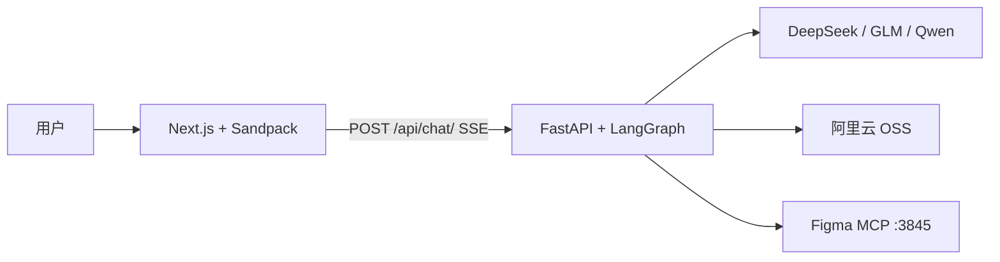
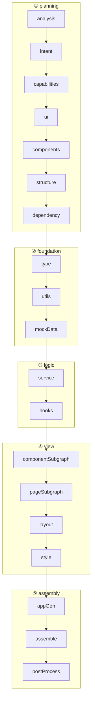
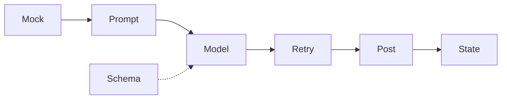
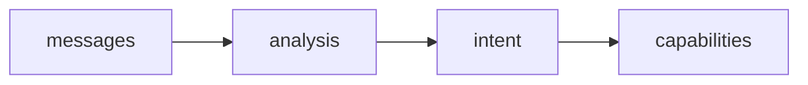
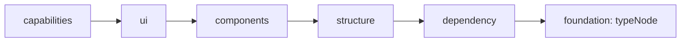
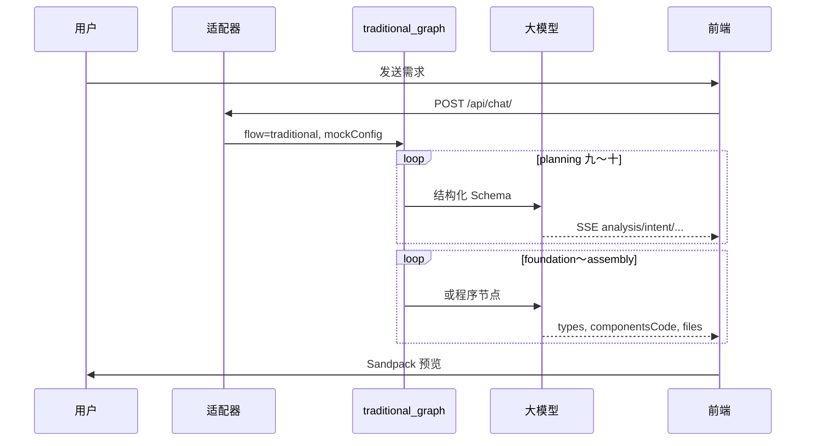

# 1 · 项目重点概述

> **配套代码：** `完整代码/figma-make/server-py`  
> **建议时长：** 12～16 课时（可分 4 次 × 3 小时：全景 → 基建与路由 → 流水线与节点 → 质量与规划）

---

## 本章学习目标

学完本章，你应该能：

1. 说清楚 **Zood Figma Make 后端** 在产品中的角色，以及 Traditional / Figma 两条路径  
2. 完成 **`.env` 多模型配置**，并用 `curl` 验证 SSE  
3. 理解 **模板项目**、**路由适配器**、**LangGraph 19 节点** 如何串联  
4. 掌握单节点的 **六大模块**（Mock / Prompt / Schema / Model / Retry / 后处理）  
5. 说清 **防幻觉分层** 与 **Pydantic Schema** 如何约束 LLM  
6. 能复述 **规划阶段 7 步**（analysis → dependency）及 State 如何滚雪球

---

## 一、产品全景与技术地图

### 1.1 一句话

**用户用自然语言或 Figma 链接描述需求 → 后端 LangGraph 多步调用大模型 → SSE 推进度 → 前端 Sandpack 实时预览 React 应用。**

```
用户输入              server-py :7001              frontend :3000
────────             ──────────────               ─────────────
「做待办 App」   →    Traditional 19 节点      →   思维链 + Sandpack
Figma 设计链接   →    Figma 9 节点 MCP       →   同上
```

### 1.2 后端核心价值

| 单次 LLM 吐整库 | 本项目 |
|-----------------|--------|
| 结构混乱 | 分阶段规划 → 目录 → 类型 → 代码 |
| 依赖幻觉 | 模板 `package.json` + import 扫描 |
| 路径/语法问题 | AST 后处理（`fixer.py` 路径与 import 修复） |
| 无进度 | 每节点一条 SSE |
| 闲聊也跑全流程 | 适配器分流 + `analysisNode` 短路 |

### 1.3 全栈架构



### 1.4 目录三层口诀

```
API 层    → routes/chat.py、template.py、upload.py
Agent 层  → graphs/traditional_graph.py、figma_graph.py、子图
Utils 层  → model、mock、retry、ast、dependency_builder
```

**必读四文件：** `main.py` → `routes/chat.py` → `adapters/route_registry.py` → `traditional_graph.py`

### 1.5 两条生成路径

| | Traditional | Figma |
|--|-------------|-------|
| 触发 | 文本 / 图片 / 修改意图 | 消息含 Figma URL |
| 节点数 | 19 + 2 子图 | 9 |
| 特点 | 分步 JSON Schema | MCP 取码 → 解析 → AI 重构 |

### 1.6 5 分钟 Demo

```bash
cd 完整代码/figma-make/server-py
cp .env.example .env   # 填 DEEPSEEK_API_KEY
uv sync && uv run uvicorn main:app --reload --port 7001

curl -sN -X POST http://localhost:7001/api/chat/ \
  -H "Content-Type: application/json" \
  -d '{"messages":[{"role":"user","content":"hi"}]}'
# 期望：analysis → chatReply → done

curl -sN -X POST http://localhost:7001/api/chat/ \
  -H "Content-Type: application/json" \
  -d '{"messages":[{"role":"user","content":"做一个待办应用"}]}'
# 期望：analysis、intent、ui … files、done
```

---

## 二、多模型配置

### 2.1 收敛设计

所有节点只通过 `agents/utils/model.py` 访问模型；密钥仅在 `.env`。

| 调用 | 函数 | 场景 |
|------|------|------|
| 结构化 JSON | `get_structured_model(Schema)` | 规划/生成节点 |
| 自由文本 | `get_main_model()` | 闲聊回复等 |

### 2.2 主模型三选一

| `MAIN_MODEL_PROVIDER` | 密钥 | 默认模型 |
|------------------------|------|----------|
| `deepseek`（默认） | `DEEPSEEK_API_KEY` | `deepseek-chat` |
| `glm` | `GLM_API_KEY` | `glm-4-flash` |
| `qwen` | `QWEN_API_KEY` | `QWEN_TEXT_MODEL=qwen-plus` |

视觉模型 **独立**：`get_qwen_vision_model()` + `QWEN_VL_MODEL`，**勿** 设为主模型。

### 2.3 结构化包装器

`StructuredModelWrapper`：`function_calling` → `json_schema` → 从 `tool_calls`/`content` 手解析 JSON → `model_validate`。

与 `with_retry`（节点内最多 3 次）叠加。

### 2.4 禁止项

- `deepseek-reasoner` 等 thinking 模型（结构化易 `None`）  
- `qwen-vl-*` 作主模型  
- 改 `.env` 后 **必须重启** uvicorn（单例缓存）

---

## 三、模板项目

### 3.1 模板 ≠ 生成结果

`templates/react-ts/` 是 **固定可运行基座**；AI **增量覆盖** `App.tsx`、pages、components 等。

| 文件 | 作用 |
|------|------|
| `index.tsx` | 入口 + ErrorBoundary |
| `App.tsx` | 未生成前的占位页 |
| `package.json` | 依赖 **基线** |
| `styles.css` | 全局样式 |

### 3.2 API 与前端

- `GET /api/template/react-ts` → `{ "/App.tsx": { "code": "..." }, ... }`  
- `SandpackView`：`template="react-ts"` + `files={mergeSandpackFiles(...)}`  
- **镜像：** 后端输出 `/App.tsx`，Sandpack 实际跑 `/src/App.tsx`（`mergeSandpackFiles`）

### 3.3 流水线中的三处用法

1. **`dependencyNode`** — 只读模板 `package.json` 进 State  
2. **`assembleNode`** — 读 `index.tsx`，合并生成物，`scan_dependencies` 写最终 `package.json`  
3. 前端 — 首屏占位 + SSE `files` 覆盖

---

## 四、路由与多 Agent

### 4.1 三层「Agent」

| 层 | 含义 | 代码 |
|----|------|------|
| ① 路由适配器 | 选 **哪条流水线** | `agents/adapters/` |
| ② 主图 | Traditional / Figma | `traditional_graph`、`figma_graph` |
| ③ 子图 | 组件/页面并行生成 | `component_graph`、`page_graph` |

**适配器在图外：** Figma 与 Traditional 的 State 差异大，分开预编译更清晰。

### 4.2 first-match 优先级

| 优先级 | 适配器 | 条件 | flow |
|--------|--------|------|------|
| 100 | figma-route | 含 Figma URL | figma |
| 90 | modification-route | 修改类关键词 | traditional |
| 80 | image-route | 图片附件 | traditional |
| 70 | prompt-route | 去 URL 后仍有文本 | traditional |
| 10 | traditional-route | 兜底 | traditional |

### 4.3 `chat.py` 衔接

```python
traditional_agent = build_agent("traditional")  # 启动时编译
figma_agent = build_agent("figma")
route_result = await resolve_route_adapter({...})
agent = figma_agent if route_result["flow"] == "figma" else traditional_agent
async for chunk in agent.astream(input_data, stream_mode="updates"): ...
```

### 4.4 图内分支（≠ 适配器）

`analysisNode` → `skipGeneration` → `conversationalReplyNode` → END（闲聊不调后续 17 步）。

---

## 五、Traditional 核心流程

### 5.1 五阶段



### 5.2 节点速查表（规划 + 本章重点）

| 节点 | 阶段 | LLM | State | SSE type |
|------|------|-----|-------|----------|
| analysisNode | planning | ✅ | analysis | analysis |
| intentNode | planning | ✅ | intent | intent |
| capabilityNode | planning | ✅ | capabilities | capabilities |
| uiNode | planning | ✅ | ui | ui |
| componentNode | planning | ✅ | components | components |
| structureNode | planning | ✅ | structure | structure |
| dependencyNode | planning | ❌ | dependency | dependency |
| typeNode | foundation | ✅ | types | types |
| … | view/assembly | … | componentsCode, files | … |

映射：`config/chat.py` → `NODE_HANDLERS`。

### 5.3 Prompt 驱动含义

每一步输出 **Pydantic 对象** → `model_dump()` 进 State → 下一步 Human Message 只带必要 JSON。

**不调 LLM：** `dependencyNode`、`assembleNode`、`postProcessNode`（后两者为程序 + AST）。

---

## 六、节点六大模块



| 模块 | 工具 | 说明 |
|------|------|------|
| ① Mock | `try_execute_mock` | `mock/*.json`，`mockConfig` 控制 |
| ② Prompt | `*_prompts.py` | System + Human + `JSON_SAFETY_PROMPT` |
| ③ Schema | `*_schema.py` | 输出契约 |
| ④ Model | `get_structured_model` | 见 二 |
| ⑤ Retry | `with_retry` | 错误拼回对话，max 3 |
| ⑥ 后处理 | `normalize_llm_result`、`process_generated_code` | 转义、单文件 AST |

**物理结构：** 每节点通常 `prompts/` + `schemas/` + `nodes/` + `mock/xxxResult.json`。

### Mock 优先级

```
nodes > phases > global > 默认（resolve 时未指定则 true；项目默认 preset 为 allReal）
```

请求示例：

```json
{ "mockConfig": { "global": false, "phases": { "planning": true } } }
```

---

## 七、降低大模型幻觉

### 7.1 本项目中的「幻觉」

虚构依赖、枚举乱写、`@/` 路径、漏文件、单次 JSON 过大、需求偏离等 → Sandpack 失败或预览空白。

### 7.2 纵深防御

```text
① 流水线拆分（窄任务）
② Prompt 硬规则（路径、单文件 mock、JSON 安全）
③ Schema + 结构化输出
④ 程序节点（依赖扫描、组装、AST）
⑤ Retry + 枚举 field_validator 容错
```

### 7.3 关键原则

- **不让 LLM 写** 最终 `package.json`（模板 + `scan_dependencies`）  
- **不让 LLM 一次出** 全项目文件清单外的所有源码（structure → 子图 fan-out）  
- **上下文裁剪**：Human Message 只带本步字段  
- **规则短路**：`hi` 不调分析 LLM

---

## 八、Schema 约束

### 8.1 角色

Schema = 步骤之间的 **API 类型定义**；`Field(description)` 同时引导模型。

```python
structured_model = get_structured_model(UIResult)
result = await with_retry(structured_model, prompt, max_retries=3)
return {"ui": result.model_dump()}
```

### 8.2 两类形态

| 类型 | 代表 | 特点 |
|------|------|------|
| 规划型 | `UIResult`、`CapabilityResult` | 深嵌套、多枚举，体积大 |
| 代码型 | `CompGenResult` | 含 `content` 源码字段 + `path` |

### 8.3 Mock 与 Schema

`mock/uiResult.json` 根对象 **即** Schema 对应结构（无额外包一层键），由 `try_execute_mock` 包进 `state.ui`。

### 8.4 枚举容错

`ui_schema` 等对非法枚举 `_coerce_enum` → 默认值，避免整节点失败（与 Retry 互补）。

---

## 九、规划阶段 Part1

**目标：** 把用户话变成 **页面 / 行为 / 数据模型** 蓝图，尚不写 `.tsx`。



### 9.1 analysisNode（step0）

| 字段 | 含义 |
|------|------|
| `type` | CREATE / MODIFY / QA / CHIT_CHAT |
| `summary` | 需求摘要 |
| `tags` | 英文标签 |
| `complexity` | SIMPLE / MEDIUM / COMPLEX |
| `designAnalysis` | 有设计图描述时填写 |

**三条路径：** 极短问候规则短路 → Mock → LLM。  
`CHIT_CHAT` / `QA` 可设 `skipGeneration` → 不跑后续规划。

### 9.2 intentNode（step1）

**产品意图：** 产品名、目标用户、场景、品类等 → `intent`。  
输入：`messages` + `analysis.summary`。

### 9.3 capabilityNode（step2）

**能力蓝图：**

| 子结构 | 作用 |
|--------|------|
| `pages[]` | pageId、route 意向、核心页 |
| `behaviors[]` | 用户行为（登录、筛选…） |
| `dataModels[]` | 实体与字段列表 |

后续 `uiNode` 的 `pageId`、`bindBehavior`、`bindDataModel` 都引用这里的 id。

### 9.4 Part1 Mock 联调

```json
{
  "messages": [{"role": "user", "content": "做一个小说阅读站"}],
  "mockConfig": { "phases": { "planning": true }, "nodes": { "uiNode": false } }
}
```

或逐节点 `"analysisNode": true` 等，观察 SSE：`analysis` → `intent` → `capabilities`。

---

## 十、规划阶段 Part2

**目标：** 可视化 + 文件清单 + 依赖基线。



### 10.1 uiNode（step3）

`UIResult`：`pages[]` → `sections[]` → `components[]`（`ComponentType` 大枚举）。  
约束：3～5 页、每 section 4～6 组件，防 JSON 过大。  
`bindDataModel` / `bindBehavior` 必须对齐 capability 的 id。

### 10.2 componentNode（step4）

把 UI 里的控件选型变成 **可生成契约**：componentId、props、events、dataDependencies → `components`。

### 10.3 structureNode（step5）

输出 `structure.files[]`：**完整路径清单**（`/pages/X.tsx`、`/hooks/useX.ts`…）。  
子图 **仅按此清单 fan-out**，是多文件并行的唯一依据。

### 10.4 dependencyNode（step6）

**不调 LLM**；`read_template_package_json()` → `dependency.packageJson`。  
最终依赖合并见 `assembleNode` + `VERSION_MAP`。

### 10.5 Part1 / Part2 对齐检查

| 应对齐 | 否则 |
|--------|------|
| `capabilities.pages[].pageId` ↔ `ui.pages[].pageId` | 路由/页面生成错位 |
| `dataModels[].modelId` ↔ `bindDataModel` | 类型/mock 对不上 |
| `structure.files` 与 ui/components 规模 | 漏生成或空子图 |

---

## 十一、端到端串讲（一章复盘）



**记忆链：** 适配器选路 → 规划出 **能力+UI+清单** → 类型/逻辑 → 子图写文件 → 组装+AST → `files` SSE。

---

## 十二、常见问题（合并 FAQ）

| 现象 | 可能原因 | 处理 |
|------|----------|------|
| SSE 立刻 `error` | API Key、模型名 | 二 |
| 只有 analysis + chatReply | 闲聊短路 | 正常 |
| `Structured model returned None` | reasoner/VL、Schema 过大 | 换 deepseek-chat；缩小 ui |
| 预览一直占位页 | 未收到 `files` 或未镜像 `/src/App.tsx` | 三 + 前端 merge |
| Figma 无代码 | MCP 未开、Tab 不对 | 第 6 章 Figma MCP |
| planning Mock 后 view 空 | 只 Mock 了 planning | `view` 阶段改 allReal 或局部 false |
| `service` SSE 无数据 | handler key 与 return 字段不一致 | 对照 `service_node` 与 `chat.py` |

---

## 十三、本章练习（精选）

1. **全景：** 画一张图包含 API / Agent / Utils、Traditional 与 Figma 两条路。  
2. **配置：** 切换 `MAIN_MODEL_PROVIDER`，用 curl 确认 `[Model] Using ...` 日志。  
3. **模板：** `curl` `/api/template/react-ts`，数清 4 个文件路径。  
4. **路由：** 发三条消息分别触发 figma / modification / prompt（看 `[RouteRegistry]`）。  
5. **Mock：** `planningMock` 跑通前三个 SSE type。  
6. **规划：** 阅读 `mock/capabilityResult.json`，列出 pages、dataModels 各一项。  
7. **Schema：** 打开 `ui_schema.py`，找一个 `ComponentType` 枚举值。  
8. **对照：** 在 `traditional_graph.py` 数规划阶段 7 个节点名。

---

## 十四、检查清单（本章结业）

- [ ] 能一句话描述产品与后端价值  
- [ ] 能启动后端并用 curl 看到 SSE  
- [ ] 能配置主模型且知视觉模型独立  
- [ ] 能解释模板、merge 镜像、dependency 两阶段  
- [ ] 能默写五档适配器优先级  
- [ ] 能说出 Traditional 五阶段与规划 7 步  
- [ ] 能描述节点六大模块与 Mock 优先级  
- [ ] 能解释 Schema、防幻觉与程序节点的分工  
- [ ] 能区分 analysis / intent / capabilities / ui / structure  

---

## 十五、后续学习路径

本章之后建议继续学习 [2. 项目基础框架搭建](../2.项目基础框架搭建/课件.md)，再进入视图生成与组装：

| 顺序 | 主题 |
|------|------|
| 2 | [项目基础框架搭建](../2.项目基础框架搭建/课件.md) |
| 3 | [子图生成组件](../3.子图生成组件/课件.md) |
| 4 | [项目组装](../4.项目组装/课件.md) |
| 5 | [AST 处理](../5.AST处理/课件.md) |
| 6 | [Figma MCP 服务](../6.Figma的MCP服务/课件.md)（支线） |
| 7 | [图片上传](../7.%20图片上传/课件.md)（支线） |
| — | 课程总览 [课件.md](../课件.md) |

---

## 本章小结

```
项目重点概述 = 产品地图 + 模型/模板/路由基建
              + Traditional 19 节点全景
              + 节点工程化（Mock/Prompt/Schema/Retry）
              + 防幻觉 + Schema
              + 规划 7 步（需求→能力→UI→清单→依赖基线）

先建立整条链，再进入各阶段源码精读。
```
