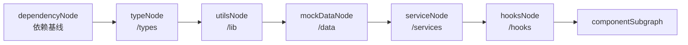
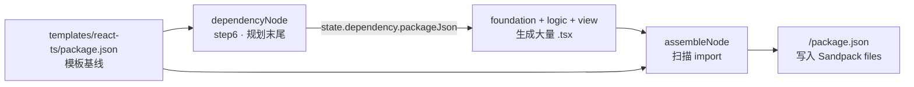
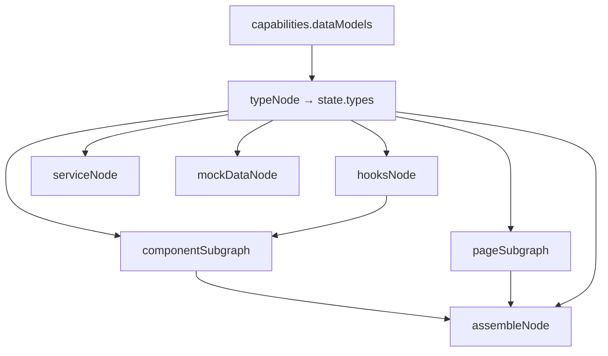
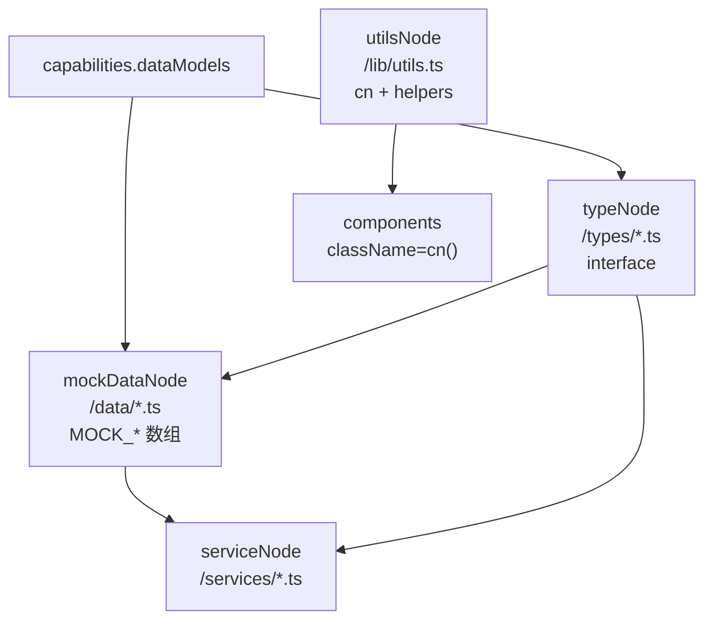
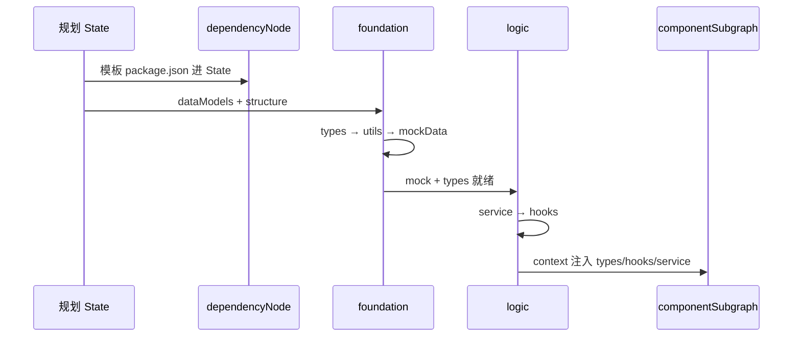

# 2 · 项目基础框架搭建

> **前置：** [1. 项目重点概述](../1.项目重点概述/课件.md)（规划 7 步、`dependencyNode` 简介）  
> **配套代码：** `完整代码/figma-make/server-py/agents/`  
> **配套素材：** 同目录 `依赖基座加载.pptx`、`基础建设.pptx`  
> **建议时长：** 5～6 课时（依赖 → 类型 → utils/mock → service/hooks）

---

## 本章学习目标

学完本章，你应该能：

1. 说清楚依赖管理的 **两阶段**：`dependencyNode` 加载基线 vs `assembleNode` 扫描合并  
2. 解释为何 **不让 LLM 推断 package.json**，并读懂 `dependency_builder.py`  
3. 说明 `typeNode` 如何把 `capabilities.dataModels` 变成 `/types/*.ts`，以及下游如何消费  
4. 区分 **`/types/*.ts`** 与 **`/data/*.ts`** 的分工，理解 `mockDataNode` 并行生成  
5. 解释 `utilsNode` 为何必须生成 **`cn()`**，以及 foundation 三件套的关系  
6. 说清 **logic 阶段** 四层架构：mock → service → hooks → 组件，并排查 import 对齐问题

---

## 一、foundation + logic 总览

规划 7 步结束后，Traditional 流水线进入 **基础建设（foundation）** 与 **逻辑（logic）** 阶段：



| 节点 | step | SSE `type` | State 键 | 阶段 | LLM |
|------|------|------------|----------|------|-----|
| `dependencyNode` | 6 | `dependency` | `dependency` | planning 末尾 | ❌ |
| `typeNode` | 7 | `types` | `types` | foundation | ✅ |
| `utilsNode` | 8 | `utils` | `utils` | foundation | ✅ |
| `mockDataNode` | 9 | `mockData` | `mockData` | foundation | ✅ |
| `serviceNode` | 10 | `service` | `service` | logic | ✅ |
| `hooksNode` | 11 | `hooks` | `hooks` | logic | ✅ |

**记忆口诀：** 先定 **依赖基座 + 类型真相**，再补 **工具 + 假数据**，然后 **service 封装业务、hooks 暴露 React 状态**，最后才进子图写 UI。

**三层数据访问（logic 必记）：**

```
UI（components/pages）→ hooks（loading/error/data）→ service（CRUD/筛选）→ data（MOCK_*）+ types
```

---

## 二、依赖基座加载

### 2.1 依赖在项目中的两次出现



| 时机 | 节点 | 做什么 | 是否 LLM |
|------|------|--------|----------|
| 规划刚结束 | `dependencyNode` | 把模板 `package.json` 放进 State | ❌ |
| 全部代码生成后 | `assembleNode` | 扫描 import，合并进 `package.json` | ❌ |

**易混点：** SSE 事件 `dependency` 出现时，**最终可安装的依赖清单尚未完成**；`dependencies: {}` 表示「新增依赖待组装阶段扫描」。

### 2.2 dependencyNode 源码精读

文件：`architecture/nodes/dependency_node.py`

```python
async def dependency_node(state: dict) -> dict:
    template_pkg = await read_template_package_json()
    return {
        "dependency": {
            "packageJson": template_pkg,
            "dependencies": {},
            "reason": "Template baseline loaded, import scanning will complete at assembly phase",
        }
    }
```

**做了什么：**

1. `read_template_package_json()` → 读 `get_template_dir() / "package.json"`  
2. 原样放入 `state["dependency"]["packageJson"]`  
3. `dependencies` 先留空，等 assemble 填充 **本轮新增** 的包  

**没做什么：** 不读 capabilities/structure；不调 LLM；无 Mock JSON 可替换。

模板 `package.json` 已含 Sandpack 常用基座：`react`、`react-dom`、`react-router-dom`、`lucide-react`、`tailwind-merge`、`recharts`、`sonner` 等。

### 2.3 dependency_builder.py — 核心工具库

路径：`agents/utils/dependency_builder.py`

> 之前让 LLM 推断依赖经常出现幻觉（不存在的包/版本）；改为程序化扫描后准确率接近 100%。

**`extract_imports(code)`** — 从源码抠包名：

```typescript
import X from 'lodash'
import { Y } from '@radix-ui/react-dialog'
const z = require('axios')
import('heavy-lib')
```

会忽略：`./` `../` `@/` `~/` 相对路径；Node 内置模块。作用域包 `@scope/pkg` 取前两段。

**`scan_dependencies(files)`** — 扫全项目，未知包 fallback 到 `"latest"` 并打日志。

**`VERSION_MAP`** — 维护型字典，收录 React 生态、Radix、图表、表单、HTTP 等常用库版本。团队新增常用包时在此扩展，改后重启后端即可。

**`build_package_json` — 合并策略：**

```python
merged_dependencies = dict(template_deps)   # 先拷贝模板全部依赖
for pkg, version in scanned_deps.items():
    if pkg not in merged_dependencies:
        merged_dependencies[pkg] = version   # 只追加模板没有的
```

| 规则 | 原因 |
|------|------|
| 模板已有 → **不覆盖版本** | 防止 LLM 生成代码把 `react` 降级成错误版本 |
| 模板没有 → 用扫描 + VERSION_MAP | 补上 `date-fns` 等后加库 |

**在 assembleNode 中调用：**

```python
code_files = [{"path": p, "code": c} for p, c in files.items() if p.endswith((".ts", ".tsx", ...))]
scanned_deps = scan_dependencies(code_files)
build_result = build_package_json(scanned_deps, dependency["packageJson"])
add_file("/package.json", json.dumps(final_pkg, indent=2), "config")
```

### 2.4 端到端示例

1. 模板 `package.json` 含 `react`、`lucide-react`  
2. `dependencyNode` → State 保存完整模板  
3. 生成组件 `import { format } from 'date-fns'`  
4. `assembleNode` 扫描 → 发现 `date-fns`  
5. `VERSION_MAP` → `^3.6.0`，模板无此项 → 写入 `dependencies`  
6. 最终 `/package.json` 在 Sandpack 中可安装运行  

---

## 三、类型生成

### 3.1 为何类型最先？

后续 mock、service、hooks、组件生成都要引用 **统一 TypeScript 接口**，先定类型可减少「字段名不一致」幻觉。

`typeNode` **不读** ui/components，只读规划阶段的 **数据模型清单**：

```python
capabilities = state.get("capabilities", {})
data_models = capabilities.get("dataModels", [])
```

Part1 中每个 `DataModel` 示例：

```json
{
  "modelId": "Novel",
  "description": "小说实体",
  "complexity": "list+detail",
  "fields": ["id", "title", "author", "status", "createdAt"]
}
```

### 3.2 typeNode 实现

| 类型 | 路径 |
|------|------|
| Node | `architecture/nodes/type_node.py` |
| Prompt | `architecture/prompts/type_prompts.py` |
| Schema | `architecture/schemas/type_schema.py` |
| Mock | `mock/typeResult.json` |

```python
mock_result = await try_execute_mock(state, "typeNode", "typeResult.json", "types")
structured_model = get_structured_model(TypeGenerationResult)
human_msg = f"""Data Models:\n{json.dumps(data_models, ...)}"""
result = await with_retry(structured_model, prompt, max_retries=3)
return {"types": result.model_dump()}
```

**Schema：**

```python
class TypeFile(BaseModel):
    path: str      # 如 /types/Novel.ts
    code: str      # 完整 TS 源码
    modelId: str   # 对应 capabilities 的 modelId

class TypeGenerationResult(BaseModel):
    files: List[TypeFile]
```

**Prompt 规则：** 每个 model 一个文件 `/types/ModelName.ts`；`export interface`；复杂字段 JSDoc；适当包含 id、createdAt、updatedAt；可 export 相关 enum。

### 3.3 与 structure 清单对齐

`structureNode` 应为每个 model 规划路径：

```json
{
  "path": "/types/Novel.ts",
  "kind": "new",
  "sourceCorrelation": "Novel",
  "generatedBy": "step6-types"
}
```

| 对齐项 | 要求 |
|--------|------|
| `modelId` | `Novel` |
| `path` | `/types/Novel.ts`（PascalCase 与 modelId 一致） |

### 3.4 下游如何消费 `types`



- **子图：** `run_component_graph` 把 types 全文拼进 Prompt  
- **service/hooks：** human_msg 列出 path + modelId  
- **mockDataNode：** 字段应对齐 interface  
- **assembleNode：** `add_file(path, code, category="types")`

**import 约定：** types 互引用用 `./Novel`；组件引类型用 `../types/Novel`；避免 `@/`。

---

## 四、工具函数与模拟数据

### 4.1 utilsNode — 工具函数

| 类型 | 路径 |
|------|------|
| Node | `code_generation/nodes/utils_node.py` |
| Prompt | `code_generation/prompts/utils_prompts.py` |
| Schema | `code_generation/schemas/utils_schema.py` |
| Mock | `mock/utilsResult.json` |

**职责：** 生成可复用的纯函数库，供组件/页面 import。

- 必备：`/lib/utils.ts` 中的 **`cn()`**（clsx + tailwind-merge）  
- 可选：`formatDate`、`truncateText`、`generateId` 等  

**输入相对轻：** 主要靠 `intent.product.name` + Prompt 硬性 Required 保证 `cn()` 存在；不读 dataModels/structure。

```python
class UtilsFile(BaseModel):
    path: str
    code: str       # 注意：utils 用 code
    description: Optional[str]
```

Prompt 硬要求：

```typescript
import { clsx, type ClassValue } from 'clsx';
import { twMerge } from 'tailwind-merge';
export function cn(...inputs: ClassValue[]) {
  return twMerge(clsx(inputs));
}
```

模板 `package.json` 已含 `clsx`、`tailwind-merge`；后续组件大量写 `className={cn(...)}`，**没有 cn() 几乎无法编译**。

### 4.2 mockDataNode — 模拟数据

| 类型 | 路径 |
|------|------|
| Node | `code_generation/nodes/mock_data_node.py` |
| Prompt | `code_generation/prompts/mock_data_prompts.py` |
| Schema | `code_generation/schemas/mock_data_schema.py` |
| Mock | `mock/mockDataResult.json` |

**职责：** 为每个 `capabilities.dataModels[]` 生成可运行的假数据：

```typescript
import { Novel } from '../types/Novel';

export const MOCK_NOVELS: Novel[] = [
  { id: '...', title: '...', ... },
  // 5～10 条
];
```

**为何按 model 并行？** 一次 Structured Output 生成全部 mock → JSON 巨大 → `parsed=None`、超时。

```python
tasks = [
    _generate_mock_for_model(model, intent, structure_files, structured_model)
    for model in data_models
]
results = await asyncio.gather(*tasks)
all_files = [file for files in results for file in files]
```

**单 model Prompt 要点：**

- 从 structure 解析目标路径（`generatedBy == "mockData"` 或 `/data/` 匹配）  
- 字段列表来自 capabilities.fields  
- 硬性约束：只生成 1 个文件；5～10 条样本；**不要 helper 函数**  

**Schema 字段名差异（易踩坑）：**

| 节点 | 文件内容字段 |
|------|----------------|
| `utilsNode` / `typeNode` | `code` |
| `mockDataNode` | **`content`** |

### 4.3 type 与 mock 的分工

| 维度 | typeNode `/types/` | mockDataNode `/data/` |
|------|-------------------|------------------------|
| 内容 | `export interface`、enum | `export const MOCK_XXX = [...]` |
| 数据来源 | dataModels 字段定义 | 同上 + 造样本值 |
| 引用关系 | 被 data 文件 import | `import { Novel } from '../types/Novel'` |

### 4.4 foundation 三件套关系图



---

## 五、逻辑构建（Service + Hooks）

### 5.1 三层数据访问架构

```
┌─────────────────────────────────────────┐
│  UI 层：components / pages (.tsx)        │
│  import { useNovels } from '../hooks/...' │
└──────────────────┬──────────────────────┘
                   ▼
┌─────────────────────────────────────────┐
│  Hooks 层：/hooks/useXxx.ts              │
│  useState + useEffect + loading/error    │
└──────────────────┬──────────────────────┘
                   ▼
┌─────────────────────────────────────────┐
│  Service 层：/services/xxxService.ts     │
│  getAll / getById / filter...            │
└──────────────────┬──────────────────────┘
                   ▼
┌─────────────────────────────────────────┐
│  Data 层：/data/*.ts  MOCK_* 常量        │
│  + /types/*.ts 类型定义                   │
└─────────────────────────────────────────┘
```

**原则：** 组件 **禁止** 直接 `import MOCK_XXX`；应通过 **hooks** 取数，hooks 再调 **service**。

图编排：`mockDataNode → serviceNode → hooksNode → componentSubgraph → ...`

### 5.2 serviceNode

| 类型 | 路径 |
|------|------|
| Node | `code_generation/nodes/service_node.py` |
| Prompt | `code_generation/prompts/service_prompt.py` |
| Schema | `code_generation/schemas/service_schema.py` |
| Mock | `mock/serviceResult.json` |

**职责：** 把 mock 内存数据封装成可复用的业务函数；按 `capabilities.behaviors` 提供 CRUD/筛选；**不发真实 HTTP**。

**输入 State：**

```python
mock_data = state.get("mockData", {})
types = state.get("types", {})
behaviors = capabilities.get("behaviors", [])
```

Human Message 只传摘要（path、description、behaviorId），不传整文件源码。

```python
class ServiceFile(BaseModel):
    path: str
    content: str      # service 用 content，不是 code
    description: str

return {"service": result_dict}
```

Mock 样例：

```typescript
import { Novel } from '../types/Novel';
import { MOCK_NOVELS } from '../data/novels';

export function getAllNovels(): Novel[] {
  return MOCK_NOVELS;
}
```

**SSE 排错：** `config/chat.py` 中 handler key 可能写 `logic`，但节点实际写入 `state["service"]`；调试以 `state["service"]` 为准。

### 5.3 hooksNode

| 类型 | 路径 |
|------|------|
| Node | `code_generation/nodes/hooks_node.py` |
| Prompt | `code_generation/prompts/hooks_prompts.py` |
| Schema | `code_generation/schemas/hooks_schema.py` |
| Mock | `mock/hooksResult.json` |

**职责：** 为 React 组件提供带状态的数据钩子；封装 service 调用；统一 `{ data, loading, error, refresh }`。

**只读 service + types，不直接读 mockData** — 强制走 service 层。

Prompt 规则：路径 `/hooks/useArticles.ts`；import service 带扩展名；禁止 `@/` 别名；Prompt 内含完整 `useArticles` 示例。

### 5.4 子图如何使用 service / hooks

```python
"context": {
    "hooks": state.get("hooks"),
    "types": state.get("types"),
    "service": state.get("service"),
    "components": state.get("components"),
}
```

`comp_gen_prompts` 要求：**优先 hooks** →（必要时）service → **禁止 hardcoded mock**。

### 5.5 与 capabilities.behaviors 的映射

| 层次 | 如何体现 |
|------|----------|
| Service | `searchNovels(query)`、`filterByTitle` 等函数 |
| Hooks | `useNovels().filterByStatus` 或带 query 参数的 hook |
| UI | 页组件 bindBehavior 含对应 behaviorId |

### 5.6 文件命名惯例

| 类型 | 惯例 | 示例 |
|------|------|------|
| Mock 常量 | `MOCK_` + 复数 | `MOCK_NOVELS` |
| Service 文件 | `{domain}Service.ts` | `novelService.ts` |
| Hook 文件 | `use` + 复数 | `useNovels.ts` |

modelId `Novel` → 常见组合：`/types/Novel.ts`、`/data/novels.ts`、`novelService.ts`、`useNovels.ts`。

---

## 六、Mock 联调速查

### 6.1 只 Mock foundation

```json
{
  "mockConfig": {
    "phases": { "foundation": true }
  }
}
```

注意 type/mock 路径与字段一致。

### 6.2 只 Mock logic

```json
{
  "mockConfig": {
    "phases": { "planning": true, "foundation": true, "logic": true }
  }
}
```

或 `"nodes": { "serviceNode": true, "hooksNode": true }`。

### 6.3 只 Mock 类型

```json
{
  "mockConfig": {
    "global": false,
    "nodes": { "typeNode": true }
  }
}
```

### 6.4 关键日志

```
[DependencyNode] Template dependencies:
[AssembleNode] Scanning imports from M code files...
[DependencyBuilder] Adding:
--- TypeNode End (N files) ---
--- MockDataNode End (5 files) ---
--- ServiceNode End (5 files) ---
--- HooksNode End (5 files) ---
[MainGraph] Invoking Component Subgraph for N items...
```

---

## 七、端到端串讲（本章复盘）



**记忆链：** 模板依赖基座 → 类型真相 → cn + 假数据 → 业务 API → React hooks → 子图写 UI。

---

## 八、常见问题（合并 FAQ）

| 现象 | 可能原因 | 处理 |
|------|----------|------|
| Sandpack 报 Cannot find module 'X' | import 了 map 未收录的包 | 加入 VERSION_MAP 或换已有库 |
| dependency SSE 后仍缺包 | 正常，要等 assemble | 看最终 `files` 里 package.json |
| 组件里字段报错 | types 与 mock 字段不一致 | 对齐 capabilities.fields |
| 类型文件数量不对 | LLM 漏 model | Retry 或 Mock；Human 列出 model 列表 |
| `cn is not defined` | utils 未生成或未 assemble | 查 utils SSE、`/lib/utils.ts` |
| mock 只有 0 个文件 | dataModels 空 | 检查 capabilityNode / Mock |
| 某 model 无 mock 文件 | 该 model LLM 失败 | 看 `[MockDataNode] Failed to generate mock for X` |
| `MOCK_NOVELS is not exported` | mock 常量名或 path 不一致 | 对齐 mockData 与 service import |
| 组件仍 import mock | hooks 未生成或 context 未注入 | 检查 hooks SSE |
| service SSE 无数据 | handler key 与 state 不符 | 对照 `service_node` 与 `chat.py` |
| utils 与 mock 字段 code/content 混用 | Schema 不同 | 按节点 Schema 写 Mock |

---

## 九、本章练习（精选）

1. **依赖：** 判断 `import React from 'react'`、`from '../Button'`、`from '@/lib/foo'`、`from 'date-fns'` 哪些会被扫描计入依赖。  
2. **依赖：** 打开模板 `package.json`，列出 5 个 dependencies，说明未 import 为何仍保留。  
3. **类型：** 从 `capabilityResult.json` 选一个 dataModel，手写最小 interface。  
4. **类型：** 在 `component_graph.py` 找到 `type_context` 拼接，说明 types 为空的影响。  
5. **utils/mock：** 读 `utilsResult.json` 与 `mockDataResult.json`，写出 mock 文件 import 的 type 路径。  
6. **mock：** 若 dataModels 有 3 个 model，mockDataNode 最少发起几次 LLM 调用？  
7. **logic：** 画从 `MOCK_NOVELS` 到列表组件显示的 import 链。  
8. **logic：** 从 capabilities Mock 选 2 个 behaviorId，在 `serviceResult.json` 找对应函数。

---

## 十、检查清单（本章结业）

- [ ] 能区分 dependencyNode 与 assembleNode 的职责  
- [ ] 能解释 merge 时「模板版本优先」  
- [ ] 知道去哪改 VERSION_MAP  
- [ ] 能说明 typeNode 只读 dataModels，path 与 modelId 对齐  
- [ ] 能说出至少 3 个消费 `types` 的下游节点  
- [ ] 能解释 utils 为何强依赖 cn 和模板依赖  
- [ ] 能说明 mock 并行生成的原因；知道 mock 用 content、utils 用 code  
- [ ] 能画四层 data → service → hooks → UI 图  
- [ ] 能说明 hooks 为何只依赖 service，不直接读 mock  

---

## 十一、后续学习路径

本章之后继续学习 [3. 子图生成组件](../3.子图生成组件/课件.md)，再进入组装与后处理：

| 顺序 | 主题 |
|------|------|
| 3 | [子图生成组件](../3.子图生成组件/课件.md) |
| 4 | [项目组装](../4.项目组装/课件.md) |
| 5 | [AST 处理](../5.AST处理/课件.md) |
| 6 | [Figma MCP 服务](../6.Figma的MCP服务/课件.md)（支线） |
| — | 课程总览 [课件.md](../课件.md) |

---

## 本章小结

```
项目基础框架搭建 = 依赖两阶段（模板基座 + import 扫描）
                  + foundation（types → utils → mockData）
                  + logic（service → hooks）
                  + 全流水线共享的类型真相与分层数据访问

LLM 不参与 package.json → 避免依赖幻觉
types 先于 mock/service/hooks → 字段对齐
mock 并行 → 控制 JSON 体积
hooks 先于子图 → 组件不写死 MOCK_*
```

先打通 foundation + logic 整条链，再进入子图与组装精读。
