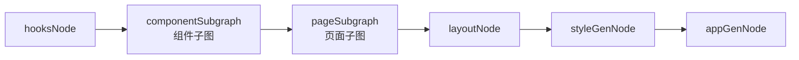
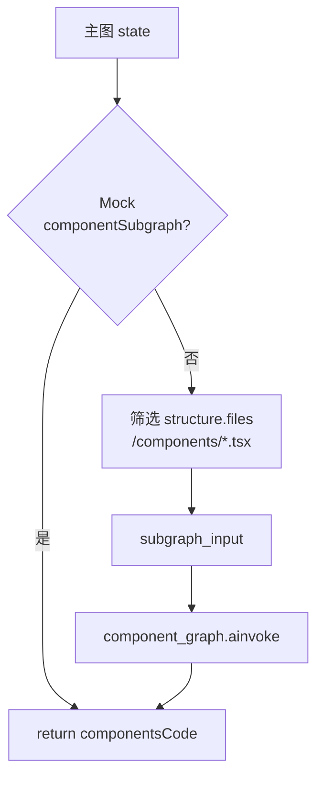
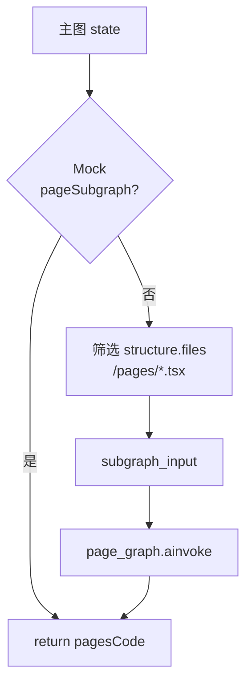
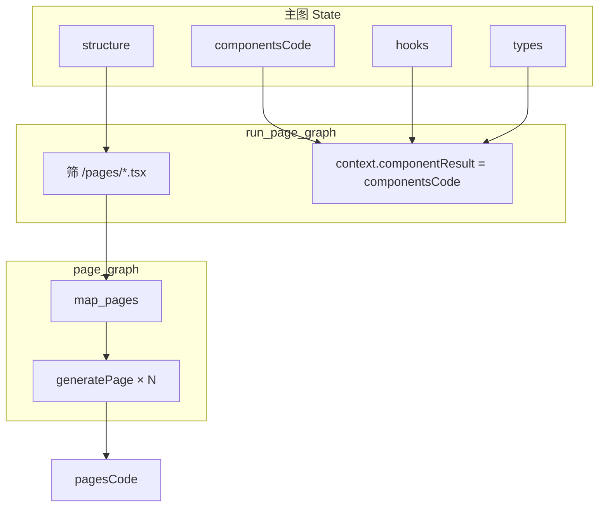

# 3 · 子图生成组件

> **前置：** [1. 项目重点概述](../1.项目重点概述/课件.md)（structure 文件清单）、[2. 项目基础框架搭建](../2.项目基础框架搭建/课件.md)（hooks/service）  
> **配套代码：** `agents/graphs/component_graph.py`、`page_graph.py`、`traditional_graph.py`  
> **配套素材：** 同目录 `子图生成组件.pptx`  
> **建议时长：** 3～4 课时（组件子图 → 页面子图 → 联调复盘）

---

## 本章学习目标

学完本章，你应该能：

1. 解释为何组件/页面生成要用 **子图 + fan-out**，而不是主图里一个 `for` 循环  
2. 读懂 LangGraph **`Send`** 与 `map_components` / `map_pages` 如何「一个文件一次 LLM」  
3. 说明桥接节点如何从 `structure` 筛出 `/components/*.tsx` 与 `/pages/*.tsx`  
4. 对照 `componentNode` 契约，理解 `generate_component_node` 如何拼 Prompt  
5. 说明 **为何页面子图必须接在组件子图之后**（`componentsCode` 作为 context）  
6. 能配置 Mock、根据日志判断并行生成了几个文件、哪个失败

---

## 一、view 阶段总览



| 主图节点名 | SSE `type` | 输出 State |
|------------|------------|------------|
| `componentSubgraph` | `componentsCode` | `componentsCode: List[{path, content, ...}]` |
| `pageSubgraph` | `pagesCode` | `pagesCode: List[{path, content, description}]` |

**前置条件：**

- `structure.files` 里已有 `/components/`、`/pages/` 路径  
- `hooks`、`types`、`components`（契约）已就绪  
- 页面子图额外要求 **`componentsCode` 非空**

主图边（`traditional_graph.py`）：

```python
graph.add_edge("componentSubgraph", "pageSubgraph")
graph.add_edge("pageSubgraph", "layoutNode")
```

**顺序不可颠倒：** 先造「积木」（组件），再用积木「搭页面」。

---

## 二、为何用子图 + fan-out？

### 2.1 若只在主图里写循环

```python
# 伪代码 — 本项目不采用
for f in components_to_generate:
    code = await llm.generate(f)  # 串行，10 个文件 ≈ 10 倍时间
```

### 2.2 本项目的做法

```
主图桥接节点 run_component_graph / run_page_graph
    → 调用已编译的子图
        → START 条件边 map_* 发出 N 个 Send
            → N 个 generate* 并行执行
                → componentsCode / pagesCode 通过 operator.add 合并
    → 返回主图 state
```

| 对比 | 串行单节点 | 子图 fan-out |
|------|------------|--------------|
| 耗时 | O(N) 次 LLM 串联 | 并行（受 API 并发限制） |
| 隔离 | 一次失败可能拖垮批次 | 单文件失败返回 `{}`，其它继续 |
| 状态 | 难表达「列表合并」 | `Annotated[..., operator.add]` |

文件头注释：10 个组件时并行可节省约 **90% 等待时间**（理想网络条件下）。

页面子图 **不能**与组件子图并行（数据依赖），但各自内部文件可并行。总耗时 ≈ hooks + max(组件并行) + max(页面并行) + layout/app（串行 LLM）。

---

## 三、组件子图（componentSubgraph）

### 3.1 桥接节点 `run_component_graph`

文件：`agents/graphs/traditional_graph.py`



**筛选规则：**

```python
components_to_generate = [
    f for f in all_files
    if "/components/" in f.get("path", "")
    and f.get("path", "").endswith((".tsx", ".jsx"))
]
```

若 `structure` 里没有 `/components/` 路径，日志会出现 `Invoking ... for 0 items`，后续页面 import 组件会报错。

**传入子图的 input：**

```python
subgraph_input = {
    "componentsToGenerate": components_to_generate,
    "context": {
        "hooks": state.get("hooks"),
        "types": state.get("types"),
        "service": state.get("service"),
        "components": state.get("components"),  # componentNode 契约
    },
}
result = await component_graph.ainvoke(subgraph_input)
return {"componentsCode": result.get("componentsCode", [])}
```

**Mock：**

```python
try_execute_mock(state, "componentSubgraph", "compGenResult.json",
    lambda data, s: {"componentsCode": data.get("componentsCode") or data})
```

`mock/compGenResult.json` 是 **数组** `componentsCode`，可一次 Mock 全部组件。

### 3.2 子图结构 `component_graph.py`

```python
class ComponentState(TypedDict, total=False):
    componentsToGenerate: List[Dict[str, Any]]
    context: Dict[str, Any]
    targetComponent: Optional[Dict[str, Any]]
    componentsCode: Annotated[List[Dict[str, Any]], operator.add]
```

```python
graph.add_node("generateComponent", generate_component_node)
graph.add_conditional_edges(START, map_components, ["generateComponent"])
graph.add_edge("generateComponent", END)
```

**`map_components` — fan-out 入口：**

```python
def map_components(state: dict) -> List[Send]:
    files = state.get("componentsToGenerate", [])
    unique = list({f.get("path"): f for f in files}.values())
    return [
        Send("generateComponent", {
            "targetComponent": f,
            "context": state.get("context", {}),
        })
        for f in unique
    ]
```

日志：`[ComponentGraph] Scheduling 8 component generations (from 8)`

### 3.3 `generate_component_node` 精读

每个并行任务只生成 **一个** `.tsx`：

| 块 | 来源 | 作用 |
|----|------|------|
| Component Spec | `components.components[]` 匹配 `componentId` | props / events / 业务描述 |
| hooks_context | `hooks.files[].content` | **优先**取数 |
| type_context | `types.files[].code` | 类型定义全文 |
| service_context | `service.files[].content` | 仅 fallback |

匹配契约：

```python
comp_spec = next(
    (c for c in comp_specs if file_name.replace(".tsx", "") in c.get("componentId", "")),
    default_spec,
)
```

**Schema：`CompGenResult`**

```python
class CompGenResult(BaseModel):
    path: str
    content: str
    description: Optional[str]
```

**System Prompt 要点：** Tailwind only；相对路径 + 扩展名，禁止 `@/`；实现 props/events；处理 loading/empty；`export default`；lucide-react 图标。

**重试：** 手写循环最多 3 次（非 `with_retry`）；失败返回 `{}`，该组件缺失。

**生成后处理：**

```python
result_dict["content"] = process_generated_code(
    result_dict["content"], file_path, types_files
)
```

单文件级 AST/路径修复，不必等 `postProcessNode`。

---

## 四、页面子图（pageSubgraph）

### 4.1 桥接节点 `run_page_graph`



**筛选规则：**

```python
pages_to_generate = [
    f for f in all_files
    if "/pages/" in f.get("path", "")
    and f.get("path", "").endswith((".tsx", ".jsx"))
]
```

**传入子图的 input（关键差异）：**

```python
subgraph_input = {
    "pagesToGenerate": pages_to_generate,
    "context": {
        "hooks": state.get("hooks"),
        "componentResult": state.get("componentsCode") or [],  # 不是 components 契约
        "types": state.get("types"),
    },
}
```

**学员必记：** 页面 LLM 看到的是 **上一节点已经写好的 `.tsx` 字符串**，不是 `componentNode` 的 JSON 契约。若跳过 `componentSubgraph` 或 Mock 了空 `componentsCode`，页面只能「猜」组件实现，import 极易失败。

页面子图 **不传** `service`；数据访问应通过 hooks。

**Mock：**

```python
mock_result = await try_execute_mock(
    state, "pageSubgraph", "pageGenResult.json",
    lambda data, _state: {
        "pagesCode": data if isinstance(data, list) else data.get("pagesCode") or data
    },
)
```

`mock/pageGenResult.json` 顶层是 `{ "pagesCode": [ ... ] }`（lambda 已兼容数组形态）。

### 4.2 子图结构 `page_graph.py`

```python
class PageState(TypedDict, total=False):
    pagesToGenerate: List[Dict[str, Any]]
    context: Dict[str, Any]
    targetPage: Optional[Dict[str, Any]]
    pagesCode: Annotated[List[Dict[str, Any]], operator.add]
```

```python
graph.add_node("generatePage", generate_page_node)
graph.add_conditional_edges(START, map_pages, ["generatePage"])
graph.add_edge("generatePage", END)
```

**`map_pages`：**

```python
def map_pages(state: dict) -> List[Send]:
    files = state.get("pagesToGenerate", [])
    unique = list({f.get("path"): f for f in files}.values())
    return [
        Send("generatePage", {
            "targetPage": f,
            "context": state.get("context", {}),
        })
        for f in unique
    ]
```

### 4.3 `generate_page_node` 精读

**拼装「代码库」上下文：**

```python
components_context = "\n\n".join(
    f"// Component: {basename}\n// File: {path}\n{content}"
    for c in component_result
)
hooks_context = "\n\n".join(
    f"// Hook: {basename}\n// File: {path}\n{content}"
    for f in hooks.get("files", [])
)
```

**JSON 形态的用户消息（与组件节点不同）：**

```python
user_input = {
    "path": file_path,
    "description": target.get("description", ""),
    "context": {
        "instruction": "Use components and hooks from the code library below...",
        "library": f"Available Hooks:\n{hooks_context}\n\nAvailable Components:\n{components_context}",
        "availableComponents": [
            {"name": "NovelTable", "path": "/components/NovelTable.tsx"},
        ],
        "availableHooks": [
            {"name": "useNovels", "path": "/hooks/useNovels.ts"},
        ],
    },
}
```

| 字段 | 作用 |
|------|------|
| `library` | 给模型完整源码参考，减少瞎编组件 |
| `availableComponents` / `availableHooks` | **白名单**，Prompt 要求只能 import 列表中的路径 |
| `description` | 来自 structure 文件条目，说明页面职责 |

**Schema：`PageGenResult`**

```python
class PageGenResult(BaseModel):
    path: str
    content: str
    description: str
```

**System Prompt 要点：** 在 `/pages/` 下组装业务组件；hooks 管理数据流；**react-router-dom**；相对路径 + 扩展名；只能 import 白名单中的文件。

重试与后处理逻辑与组件子图相同。

---

## 五、组件子图 vs 页面子图

| 维度 | 组件子图 | 页面子图 |
|------|----------|----------|
| 文件 | `component_graph.py` | `page_graph.py` |
| 桥接 | `run_component_graph` | `run_page_graph` |
| 筛选 | `"/components/"` + `.tsx/.jsx` | `"/pages/"` + `.tsx/.jsx` |
| fan-out | `map_components` → `generateComponent` | `map_pages` → `generatePage` |
| 合并键 | `componentsCode` + `operator.add` | `pagesCode` + `operator.add` |
| Mock 文件 | `compGenResult.json` | `pageGenResult.json` |
| context 核心 | `components` **契约** + hooks/types/service | **`componentResult`**（已生成源码）+ hooks/types |
| Prompt 形态 | 多段纯文本 HumanMessage | **JSON** `user_input` |
| Schema | `CompGenResult` | `PageGenResult` |
| 额外能力 | 实现 props/events | react-router-dom、页面级数据流、Skeleton |



---

## 六、从规划到代码的追溯链

**组件：**

```
uiNode:  id=SearchInput, type=Input, bindBehavior=[searchNovels]
    ↓
componentNode:  componentId=NovelSearchInput, props/onSearch
    ↓
structureNode:  path=/components/NovelSearchInput.tsx, generatedBy=component
    ↓
componentSubgraph:  生成 NovelSearchInput.tsx，import useXxx from '../hooks/...'
```

**页面：**

```
uiNode.pages[]:  pageId, route, layout, description
    ↓
structureNode:   path=/pages/NovelList.tsx, generatedBy=page
    ↓
componentSubgraph: 生成 /components/NovelTable.tsx 等
    ↓
pageSubgraph:      组装 NovelList.tsx，import 上述组件 + useNovels
    ↓
layoutNode → appGenNode → assembleNode
```

**排错顺序：**

1. Sandpack 报某个 **页面** 文件 → 查 `pagesCode` 是否生成  
2. 报 **组件** 未找到 → 先查 `componentsCode` 是否有对应 path  
3. 报 **hooks** → 查 logic 阶段与 import 是否带 `.ts` 扩展名  

从 Sandpack 报错组件名 **反查这条链**，看哪一环 ID 不一致。

---

## 七、SSE、前端与后续节点

- 主图在 **整段子图结束** 后各推一次 `componentsCode`、`pagesCode`（非每个子任务一条 SSE）  
- 前端 `sandpackFromEvent` 把 `{path, content}` 写入 Sandpack 文件树  
- curl 流中应先后看到：`componentsCode` → `pagesCode` → `layouts` / `styles` / `app` / `files`

| 节点 | 依赖 pagesCode 的方式 |
|------|-------------------------|
| `layoutNode` | 读 `ui.pages` 的 layout 类型，**不直接读** pagesCode |
| `appGenNode` | 扫描 `pagesCode` 路径生成 `App.tsx` 路由表 |
| `assembleNode` | 合并 `pagesCode` 进最终 `files` |

**页面子图完成 ≠ 应用可运行**，还需要 layout + app + assemble。

---

## 八、Mock 与联调

### 8.1 全 Mock view 阶段

```json
{
  "mockConfig": {
    "nodes": {
      "componentSubgraph": true,
      "pageSubgraph": true
    }
  }
}
```

配合 `compGenResult.json` + `pageGenResult.json`，快速看到多页面 Sandpack。

### 8.2 真实生成组件、Mock 页面

```json
{
  "mockConfig": {
    "phases": { "planning": true, "foundation": true, "logic": true },
    "nodes": {
      "componentSubgraph": false,
      "pageSubgraph": true
    }
  }
}
```

验证 Mock 页面 import 是否与真实 `componentsCode` 文件名一致。

### 8.3 期望日志顺序

```bash
grep -E "ComponentGraph|PageGraph|Component Subgraph|Page Subgraph"
```

```
[MainGraph] Invoking Component Subgraph for N items...
[ComponentGraph] Scheduling ...
[ComponentGraph] Generating: SearchInput.tsx...
...
[MainGraph] Invoking Page Subgraph for M items...
[PageGraph] Scheduling M page generations ...
[PageGraph] Generating: /pages/NovelList.tsx...
```

若 Page 在 Component 之前出现，说明图边被改坏，应恢复 `componentSubgraph → pageSubgraph`。

---

## 九、常见问题（合并 FAQ）

| 现象 | 原因 | 处理 |
|------|------|------|
| `0 items` 子图 | structure 无对应路径 | 检查 structureNode / Mock |
| 某组件/页面缺失 | 该文件 LLM 3 次失败 | 看 Retry 日志；手补或重跑 |
| import hooks 报错 | 路径无 `.ts`、hooks 未生成 | 对齐 `useNovels.ts` 路径 |
| 组件不用 hooks 直接 mock | hooks_context 为空 | 检查 logic 阶段 |
| props 与页面使用不一致 | 契约匹配失败用了 default | 改 componentId 与文件名对应 |
| 页面 import 组件 404 | `componentsCode` 缺该文件 | 先修组件子图 |
| `availableComponents` 为空仍生成 import | 跳过了 componentSubgraph | 检查 Mock 与图边顺序 |
| 路由不工作 | 仅 pages 完成，未跑 appGenNode | 等 assembly 阶段 |
| 用了 `@/components` | 违反 Prompt | 后处理或重跑 |
| 并行很慢 | API 限流或模型慢 | 正常；可减少 structure 里文件数量测 |

---

## 十、本章练习（精选）

1. 读 `compGenResult.json`，数有几个 `path`，与 structure 里 `generatedBy=component` 的条目对比。  
2. 在 `generate_component_node` 中标出：hooks_context 拼接、契约匹配、return 三处。  
3. 打开 `pageGenResult.json`，列出所有 `path`，与 structure 里 `generatedBy=page` 对比。  
4. 在 `run_page_graph` 与 `generate_page_node` 中分别标出：`componentResult` 从哪来、如何变成 `availableComponents`。  
5. 对比组件节点的纯文本 Prompt 与页面节点的 `json.dumps(user_input)`，各写一句适合该形态的理由。  
6. 若把主图边改成 `hooksNode → pageSubgraph → componentSubgraph`，预测至少 2 条具体错误。  
7. 说明若删掉 `map_components` 里去重，可能发生什么。  
8. 设计题：若希望每个组件生成完就推一条 SSE，你会改主图还是子图？

---

## 十一、检查清单（本章结业）

- [ ] 能解释 Send / fan-out 的作用  
- [ ] 能说出两个桥接节点各自的筛选路径条件  
- [ ] 能说明 hooks 优先、service fallback 的原因  
- [ ] 知道单文件失败不会拖垮整个子图  
- [ ] 能解释 `componentResult` 与 `components` 契约的区别  
- [ ] 知道 `availableComponents` 是防幻觉白名单  
- [ ] 知道 pages 完成后还有 layout / app / assemble  
- [ ] 能复述组件 → 页面的图边顺序及不可颠倒的原因  

---

## 十二、后续学习路径

本章之后继续学习 [4. 项目组装](../4.项目组装/课件.md)，再进入 AST 后处理：

| 顺序 | 主题 |
|------|------|
| 4 | [项目组装](../4.项目组装/课件.md) |
| 5 | [AST 处理](../5.AST处理/课件.md) |
| — | 课程总览 [课件.md](../课件.md) |
| 22 | Mock 设计详解 |

---

## 本章小结

```
子图生成组件 = componentSubgraph（造积木）
            + pageSubgraph（搭页面）
            + Send fan-out 并行 + operator.add 合并
            + 契约/hooks/types 驱动组件 Prompt
            + componentsCode 驱动页面 Prompt 白名单

先组件后页面，顺序不可颠倒
并行子图是 view 阶段耗时的主要来源，也是 Sandpack 里业务 UI 的真正诞生处
```

先理解 fan-out 模式与 context 差异，再进入 assemble 与 AST 精读。
