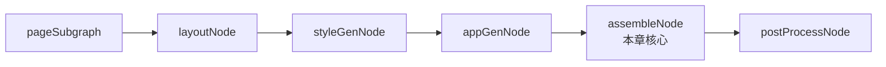
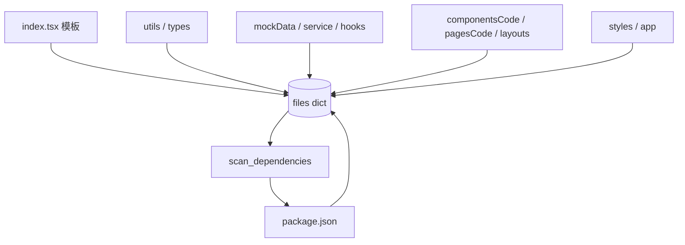
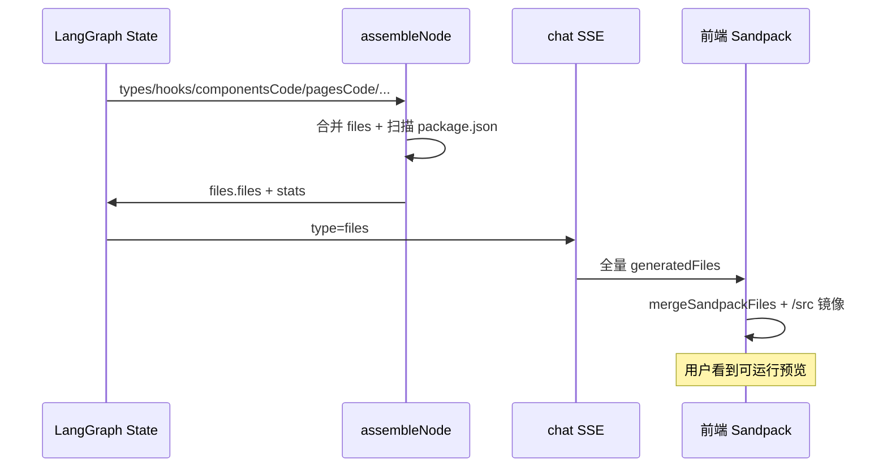

# 4 · 项目组装

> **前置：** [1. 项目重点概述](../1.项目重点概述/课件.md)（模板项目）、[2. 项目基础框架搭建](../2.项目基础框架搭建/课件.md)（依赖两阶段）、[3. 子图生成组件](../3.子图生成组件/课件.md)（componentsCode / pagesCode）  
> **配套代码：** `assembly/nodes/assemble_node.py`、`app_gen_node.py`；前置 `layout_node.py`、`style_gen_node.py`  
> **配套素材：** 同目录 `项目组装.pptx`  
> **建议时长：** 90～120 分钟

---

## 本章学习目标

学完本章，你应该能：

1. 说清 **assembly 阶段** 五个节点各自职责，以及为何 `assembleNode` **不调 LLM**  
2. 对照 `assemble_node.py`，列出合并进 `files` 的 State 来源与 `code` / `content` 字段差异  
3. 理解 `_normalize_path` 与前端 `mergeSandpackFiles` 如何配合 Sandpack  
4. 复述 `scan_dependencies` → `build_package_json` 在组装时的二次依赖合并  
5. 能根据 `files` SSE 与终端 `Categories` 日志判断缺了哪一类文件

---

## 一、assembly 阶段在主图中的位置

view 阶段（子图 + layout + style）产出「散落」的源码片段；**assembly 阶段**把它们收成 Sandpack 可运行的 **单一文件树**。



| 节点 | 是否 LLM | State 写入 | SSE `type` |
|------|----------|------------|------------|
| `layoutNode` | 是 | `layouts`（含 `layoutsCode`、`routeStructure`） | `layouts` |
| `styleGenNode` | 是 | `styles`（`path` + `content`） | `styles` |
| `appGenNode` | 是 | `app`（`/App.tsx` 路由入口） | `app` |
| **`assembleNode`** | **否** | **`files`** | **`files`** |
| `postProcessNode` | 否 | 覆盖 `files`（有修复时） | `files`（同 type） |

主图编排（`traditional_graph.py`）：

```python
graph.add_edge("pageSubgraph", "layoutNode")
graph.add_edge("layoutNode", "styleGenNode")
graph.add_edge("styleGenNode", "appGenNode")
graph.add_edge("appGenNode", "assembleNode")
graph.add_edge("assembleNode", "postProcessNode")
```

**结论：** 到 `assembleNode` 为止，State 里已有「零件」；组装节点只做 **确定性合并 + 依赖扫描**，把零件装进一个 `dict[path, content]`。

---

## 二、组装前的三个 LLM 节点（简要）

本节重点在 `assembleNode`，但这三个节点的输出 **必须先进 State**，组装才有料。

### 2.1 `layoutNode` — 布局壳 + 路由嵌套图

- 输入：`ui.pages[]`（`pageId`、`layout`、`route`）  
- 输出：`layouts.layoutsCode[]` + `layouts.routeStructure`  
- 每个 Layout 含 `<Outlet />`，供 `appGenNode` 做嵌套路由  

Mock：`layoutResult.json`

### 2.2 `styleGenNode` — 全局样式

- 输入：`ui.themeStrategy`、`analysis.designAnalysis`  
- 输出：通常 `/styles.css` 的 `content`  
- 与 Tailwind 互补（变量、动画等）  

Mock：`styleGenResult.json`

### 2.3 `appGenNode` — 路由入口

- 输入：`ui.pages`、`pagesCode` 路径列表、`layouts.routeStructure`、`layoutsCode` 路径、模板 `dependency.packageJson`（推断 Provider）  
- 输出：`app.path` + `app.content`（`BrowserRouter` + `Routes` 嵌套）  
- 将 `[id]` 路由转为 React Router 的 `:id` 形式  

Mock：`appGenResult.json`（`config/mock.py` 中归属 **assembly** 阶段，仅此节点）

```python
# app_gen_node 从 pagesCode 提取组件名
match = re.search(r"/pages/([^.]+)\.tsx$", path)
```

**为何 App 在 assemble 之前生成？**  
`assembleNode` 需要完整的 `App.tsx` 字符串；路由逻辑复杂，仍交给 LLM，组装只负责 **拷贝进文件树**。

---

## 三、`assembleNode` 核心：纯 Python 合并

文件：`agents/flows/traditional/assembly/nodes/assemble_node.py`  
文件头注释：`step16: File assembly node (no LLM, pure Python)`。

### 3.1 输出结构

```python
return {
    "files": {
        "files": {          # path -> 源码字符串
            "/index.tsx": "...",
            "/App.tsx": "...",
            "/pages/NovelList.tsx": "...",
            "/package.json": "{ ... }",
            ...
        },
        "stats": {
            "totalFiles": 42,
            "categories": {
                "entry": 2,
                "types": 5,
                "components": 8,
                "pages": 6,
                "config": 1,
                ...
            },
        },
    },
}
```

SSE（`config/chat.py`）：

```python
"assembleNode": {"type": "files", "key": "files"},
```

前端 `useChat` 收到 `type === "files"` 时 **全量覆盖** `generatedFiles`（与增量 `componentsCode` / `pagesCode` 不同）。

### 3.2 内部工具函数

```python
def add_file(file_path, content, category):
    normalized = _normalize_path(file_path)
    files[normalized] = content          # 同 path 后写覆盖先写
    categories[category] += 1

def add_files(items, category, code_key="content"):
    # 遍历数组，取 path + code_key 字段
```

### 3.3 路径规范化 `_normalize_path`

```python
def _normalize_path(file_path: str) -> str:
    normalized = file_path if file_path.startswith("/") else f"/{file_path}"
    if normalized.startswith("/src/"):
        normalized = normalized[4:]   # 去掉 /src 前缀
    return normalized
```

| 输入路径 | 写入 `files` 的键 |
|----------|------------------|
| `/pages/Home.tsx` | `/pages/Home.tsx` |
| `/src/App.tsx` | `/App.tsx` |
| `pages/X.tsx` | `/pages/X.tsx` |

与生成 Prompt「禁止 `/src/` 前缀」一致；若 LLM 仍写出 `/src/`，组装会剥掉前缀。

---

## 四、合并顺序与 State 来源（必读表）

按 `assemble_node.py` **实际执行顺序**：

| 顺序 | 来源 State | 读取方式 | 内容字段 | category |
|------|------------|----------|----------|----------|
| 1 | 模板 `templates/react-ts/index.tsx` | `get_template_dir()` | 文件全文 | `entry` |
| 2 | `utils` | `utils.files[]` | **`code`** | `utils` |
| 3 | `styles` | 单对象 `path` + `content` | `content` | `styles` |
| 4 | `app` | 单对象 | `content` | `entry` |
| 5 | `types` | `types.files[]` | **`code`** | `types` |
| 6 | `mockData` | `mockData.files[]` | `content` | `mockData` |
| 7 | `service` | `service.files[]` | `content` | `service` |
| 8 | `hooks` | `hooks.files[]` | `content` | `hooks` |
| 9 | `componentsCode` | 数组 | `content` | `components` |
| 10 | `pagesCode` | 数组 | `content` | `pages` |
| 11 | `layouts` | `layouts.layoutsCode[]` | `content` | `layouts` |
| 12 | `dependency` | 扫描上表合并后的 `files` | 生成 `package.json` | `config` |



**覆盖规则：** 同一 `normalized` 路径，**后执行的 `add_file` 覆盖先写的**。正常规划下路径不重复；若重复，以表中靠后的来源为准。

**常见遗漏：**

| 现象 | 可能原因 |
|------|----------|
| 无 `/package.json` | `state["dependency"]` 为空或未跑 `dependencyNode` |
| 无某页面 | `pagesCode` 为空或该页 LLM 失败返回 `{}` |
| 无 `index.tsx` | 模板读失败会用硬编码 fallback（日志有 Warning） |

---

## 五、程序化依赖：组装时写 `package.json`

与第 2 章「依赖两阶段」衔接：

```python
code_files = [
    {"path": p, "code": c}
    for p, c in files.items()
    if p.endswith((".ts", ".tsx", ".js", ".jsx"))
]
scanned_deps = scan_dependencies(code_files)
build_result = build_package_json(scanned_deps, dependency["packageJson"])
add_file("/package.json", json.dumps(final_pkg, indent=2), "config")
```

要点：

1. **扫描的是已合并的 `files`**，包含组件、页面、hooks 等全部 import  
2. **基线**来自 `dependencyNode` 保存的模板 `packageJson`  
3. **新增包**只在模板 `dependencies` 中不存在时写入；模板版本优先  
4. 未知包名 → `VERSION_MAP` 无条目时用 `"latest"`（日志会提示）

终端期望日志：

```
[AssembleNode] Scanning imports from 28 code files...
[AssembleNode] Found 12 third-party packages from imports
[DependencyBuilder] Adding: date-fns@^3.6.0
[AssembleNode] Added 3 new dependencies: date-fns, ...
--- AssembleNode Complete ---
Total files: 35
Categories: {"entry":2,"types":5,...}
```

---

## 六、与前端 Sandpack 的契约

### 6.1 后端：根路径文件树

组装结果路径形如：

```
/index.tsx
/App.tsx
/styles.css
/package.json
/pages/NovelList.tsx
/components/NovelTable.tsx
/hooks/useNovels.ts
/layouts/MainLayout.tsx
...
```

### 6.2 前端：模板 + 生成物 + 镜像

`frontend/src/lib/mergeSandpackFiles.ts`：

```typescript
const ROOT_TO_SRC_MIRROR = [
  ["/App.tsx", "/src/App.tsx"],
  ["/index.tsx", "/src/index.tsx"],
  ["/styles.css", "/src/styles.css"],
];
```

Sandpack `react-ts` 模板从 **`/src/index.tsx`** 启动；若只写根目录 `/App.tsx` 而不镜像，预览可能仍显示模板占位页（见第 1 章模板项目）。

数据流：

```
SSE files { files: { "/App.tsx": "..." } }
  → useChat setGeneratedFiles
  → mergeSandpackFiles(templateFiles, generatedFiles)
  → SandpackProvider files=
```

### 6.3 `assembleNode` 与 `postProcessNode` 两次 `files` 事件

| 次序 | 节点 | 行为 |
|------|------|------|
| 第一次 | `assembleNode` | 合并后的原始文件树 |
| 第二次 | `postProcessNode` | AST 修复后再次推送 `type: files`（有修复时） |

前端对 `files` 为 **覆盖更新**；第二次会替换第一次，预览应以 **postProcess 之后** 为准。

---

## 七、Mock 配置说明

`assembleNode` **没有 Mock**（无 `try_execute_mock`），永远执行合并逻辑。

| 节点 | Mock 阶段 | 说明 |
|------|-----------|------|
| `layoutNode` | view | `layoutResult.json` |
| `styleGenNode` | view | `styleGenResult.json` |
| `appGenNode` | assembly | `appGenResult.json` |
| `assembleNode` | — | 始终真实合并当前 State |

**全链路 Mock 调试示例：**

```json
{
  "mockConfig": {
    "global": true,
    "phases": { "assembly": false },
    "nodes": { "appGenNode": false }
  }
}
```

上面表示：规划/视图用 Mock，但 **真实生成 App.tsx**，再交给 `assembleNode` 合并 Mock 的组件与页面——用于验证路由是否与 `pagesCode` 一致。

`config/mock.py` 中 `ALL_NODES` **不包含** `assembleNode` / `postProcessNode`。

---

## 八、端到端：从 State 到可预览项目



**检查「组装是否成功」：**

1. SSE 是否出现 `files`，且 `totalFiles` / 键数量合理  
2. `files` 是否含 `/App.tsx`、`/index.tsx`、`/package.json`  
3. Sandpack 是否报 `Cannot find module`（依赖扫描问题，回第 2 章依赖节）  
4. 是否仍为占位页（查 `/src/App.tsx` 镜像）

---

## 九、与子图阶段的关系

| 阶段 | 产出形态 | 组装如何消费 |
|------|----------|--------------|
| `componentSubgraph` | `componentsCode[]` | `add_files(..., "components")` |
| `pageSubgraph` | `pagesCode[]` | `add_files(..., "pages")` |
| `layoutNode` | `layouts.layoutsCode[]` | 同上，`layouts` |
| 中间 SSE | 前端可增量预览单文件 | **不改变** 最终 `files` 全量结构 |

子图阶段推 `componentsCode` / `pagesCode` 便于 **边生成边预览**；**真正可安装依赖、带入口的完整工程** 以 `files` 事件为准。

---

## 十、常见问题（FAQ）

| 现象 | 原因 | 处理 |
|------|------|------|
| `files` 很少 | 前面节点未写入 State 或 LLM 失败 | 查各阶段 SSE；看 `Categories` 哪类为 0 |
| 有页面无路由 | `appGenNode` 失败或未跑 | 查 `app` SSE / Mock |
| `utils` 有但 Sandpack 报 `cn` 未定义 | 未合并进 files | 查 utils 用 `code` 字段是否有值 |
| `service` 在 assemble 读不到 | 应用 `state["service"]` | 节点 return 键为 `service`（非 `logic`） |
| 重复 `package.json` 内容异常 | 合并策略以模板为准 | 检查 `dependency.packageJson` |
| 路径 `/src/pages/...` | 生成违反约定 | postProcess 或重跑；组装会剥 `/src` |
| 只有增量事件无最终预览 | 未等到 `files` | 必须跑完 `assembleNode` |
| `Categories` 无 `config` | 无 `dependency` | 补跑 `dependencyNode` |
| Sandpack 报缺包 | import 扫描未收录 | 查 VERSION_MAP；回第 2 章依赖节 |

---

## 十一、本章练习（精选）

1. 打开 `assemble_node.py`，按执行顺序列出 12 步数据来源；标出哪些用 `code`、哪些用 `content`。  
2. 假设 `componentsCode` 与 `pagesCode` 各 5 个文件，`types` 3 个，`hooks` 4 个，估算 `stats.totalFiles` 至少多少（含模板 index、styles、app、package.json）。  
3. 在 `build_package_json` 中写出：若模板已有 `react@^18.3.1`，扫描也得到 `react`，最终版本来自哪里？  
4. 读 `mergeSandpackFiles.ts`，说明为何需要 `ROOT_TO_SRC_MIRROR`。  
5. Sandpack 报 `Cannot find module 'sonner'`，但 `App.tsx` 里有 `<Toaster />`。列出从 `appGenNode` 到 `assembleNode` 应检查的 3 个位置。

---

## 十二、检查清单（本章结业）

- [ ] 能说出 assembly 五个节点及谁用 LLM  
- [ ] 能区分 `code` 与 `content` 两类字段  
- [ ] 能解释 assemble 与 dependencyNode 的两阶段依赖关系  
- [ ] 知道前端 `files` 事件会全量覆盖并做 `/src` 镜像  
- [ ] 知道 `assembleNode` 无 Mock，合并的是当前 State 快照  
- [ ] 能根据 `Categories` 日志定位缺失的文件类别  

---

## 十三、后续学习路径

本章之后继续学习 [5. AST 处理](../5.AST处理/课件.md)：

| 顺序 | 主题 |
|------|------|
| 5 | [AST 处理](../5.AST处理/课件.md) |
| 6 | [Figma MCP 服务](../6.Figma的MCP服务/课件.md)（支线） |
| — | 课程总览 [课件.md](../课件.md) |

---

## 本章小结

```
assembly 阶段 = layout + style + app（LLM）→ assemble（程序）→ postProcess（程序）

assembleNode：
  · 读遍 State 里所有生成物 + 模板 index.tsx
  · 统一路径、按 category 统计
  · 扫描 import 写出最终 package.json
  · 输出 files → SSE 推前端全量 Sandpack 文件树

不调 LLM = 快、稳、可重复；依赖准确率依赖 scan 而非模型幻觉
```

先理解「零件从哪来、怎么合并」，再进入 AST 修复精读。
