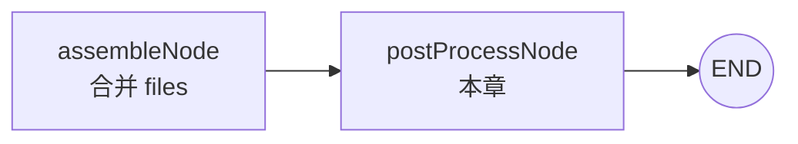
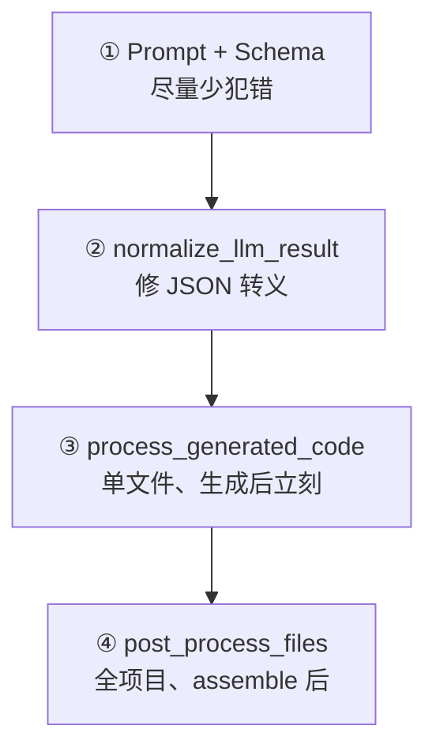
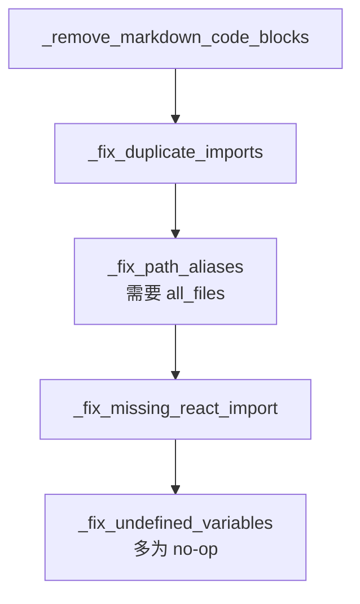
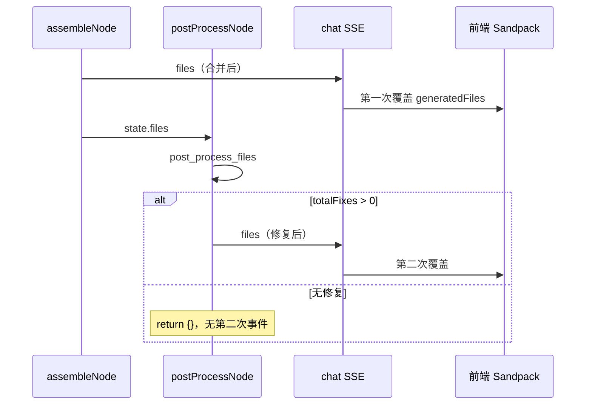

# 5 · AST 处理

> **前置：** [4. 项目组装](../4.项目组装/课件.md)（`assembleNode` 产出 `files`）、[3. 子图生成组件](../3.子图生成组件/课件.md)  
> **配套代码：** `完整代码/figma-make/server-py/agents/flows/traditional/assembly/nodes/post_process_node.py`、`agents/utils/ast/fixer.py`  
> **子图调用：** `agents/graphs/component_graph.py`、`page_graph.py`  
> **建议时长：** 90～120 分钟

---

## 本章学习目标

学完本章，你应该能：

1. 说明 **为何在 assemble 之后还要跑 `postProcessNode`**，以及它与 Prompt 防幻觉的关系  
2. 区分 **单文件** `process_generated_code` 与 **全项目** `post_process_files` 的能力边界  
3. 按顺序说出 `process_file` 里各 fixer 做什么、依赖什么输入  
4. 读懂 `post_process_node` 何时 `return {}`、何时再次推送 SSE `files`  
5. 能根据 `[AST PostProcess]` 日志判断预览报错是否应在后处理阶段解决

---

## 一、流水线中的位置



| 节点 | LLM | 输入 State | 输出 |
|------|-----|------------|------|
| `assembleNode` | 否 | 各阶段碎片 + 模板 | `files: { files, stats }` |
| **`postProcessNode`** | **否** | **`files.files`** | 有修复时覆盖 `files`（含 `astFixes`） |

```python
graph.add_edge("assembleNode", "postProcessNode")
graph.add_edge("postProcessNode", END)
```

SSE（`config/chat.py`）：

```python
"assembleNode": {"type": "files", "key": "files"},
"postProcessNode": {"type": "files", "key": "files"},  # 同 type，前端覆盖更新
```

**要点：** 一次完整生成可能收到 **两次** `type: files`——先 assemble 的「原始合并」，再 postProcess 的「修过后」（若有修复）。Sandpack 预览应以 **第二次为准**。

---

## 二、为什么要 AST 后处理？

### 2.1 Sandpack 的硬约束

| 能力 | Vite 本地工程 | 本项目的 Sandpack |
|------|---------------|-------------------|
| `@/`、`~/` 路径别名 | 常配置 | **不支持** |
| `import './foo'` 无扩展名 | 常能解析 | **常失败** |
| 相对路径跨目录 | 正常 | 必须对准 **扁平根路径** `/pages`、`/components` |

生成 Prompt 已反复禁止 `@/`，但模型仍会偶发写出别名、漏扩展名、带 `../src/` 等。

### 2.2 设计分层（与防幻觉呼应）



| 层级 | 时机 | 能否看到「整个项目文件表」 |
|------|------|---------------------------|
| ③ 单文件 | 子图每个文件生成后 | **否**（未传入 `all_files`） |
| ④ 全项目 | `postProcessNode`，assemble 之后 | **是** |

**结论：** 能把 `@/components/X` 改成 `../components/X.tsx` 的 **跨文件路径解析**，主要发生在 **④**。

### 2.3 与 `assembleNode` 的分工

| 步骤 | 节点 | 处理对象 | 典型修复 |
|------|------|----------|----------|
| 路径归一 | `assembleNode` | 写入 `files` 前的 `path` | 剥 `/src/`、补前导 `/`（`_normalize_path`） |
| 内容修复 | **`postProcessNode`** | 已合并的 **文件内容** | `@/` → 相对路径、补 `.tsx` 扩展名、去围栏 |

### 2.4 能力边界（本章不覆盖）

`fixer.py` 使用 **正则 + 路径表**，不做完整 TS/JSX 语法树分析。下列问题主要靠 **Prompt、Schema、typeNode** 在生成阶段避免，后处理 **不负责** 自动改写：

| 问题 | 说明 |
|------|------|
| `{article.author}` 直接渲染对象 | React 报 `Objects are not valid as a React child` |
| 深层 `a.b.c` 空指针 | 需 hooks/service 与生成 Prompt 约束 |

若 Sandpack 报上述运行时错误，应回查 **types 字段定义** 与 **组件 Prompt**，而非指望 `postProcessNode`。

---

## 三、`fixer.py` 实现说明

文件头注释：

```text
Python equivalent of the TypeScript AST fixer (uses regex instead of Babel AST).
```

本项目 **生产路径仅使用** `server-py` 下的 `fixer.py`：依赖少、部署简单，专注 Sandpack **能解析、能安装** 的路径与 import 问题。

---

## 四、`post_process_node` 与 State 契约

`assembleNode` 写入的 `files` 是 **嵌套对象**：

```json
{
  "files": {
    "/pages/NovelList.tsx": "export default function ...",
    "/package.json": "{ ... }"
  },
  "stats": { "totalFiles": 35, "categories": { ... } }
}
```

```python
async def post_process_node(state: dict) -> dict:
    assembled_files = state.get("files", {})
    file_map = assembled_files.get("files", {})
    if not file_map:
        return {}
    try:
        result_data = post_process_files(file_map)
        # totalFixes > 0 时合并 stats，写回 files + astFixes
    except Exception as e:
        print(f"[PostProcess] AST post-processing failed: {e}")
        return {}  # fail-open，不阻断流水线
```

| 行为 | 含义 |
|------|------|
| `file_map` 为空 | 跳过，返回 `{}` |
| `totalFixes > 0` | 写回 `files`，再推 SSE |
| `totalFixes == 0` | 返回 `{}`，沿用 assemble 结果 |
| 异常 | 打印日志，返回 `{}` |

**无 Mock：** `config/mock.py` 的 assembly 阶段 **不包含** `postProcessNode`；后处理永远对当前 State 快照执行。

---

## 五、全项目处理：`post_process_files`

```python
def post_process_files(files: Dict[str, str]) -> Dict[str, Any]:
    for file_path, code in files.items():
        if not should_process_file(file_path):
            fixed_files[file_path] = code
            continue
        fixed_code, applied_fixes = process_file(code, file_path, files)
```

### 5.1 哪些文件会处理？

```python
_PROCESSABLE_EXTENSIONS = {".tsx", ".ts", ".jsx", ".js"}
_SKIP_PATTERNS = {"node_modules", ".d.ts", "vite.config", "tailwind.config", "package.json"}
```

`/package.json`、`/styles.css` 等 **不会** 走 fixer，原样保留。

### 5.2 修复报告

控制台示例：

```text
[AST PostProcess] Found 5 issues, fixed 5 (12ms)
  /pages/NovelList.tsx (2 fixes)
    → Rewrote alias import '@/components/NovelTable'
    → Added extension for import '../hooks/useNovels'
```

修复后 `stats` 可含 `astFixes`、`astIssues`。

---

## 六、单文件处理：`process_file` 流水线

按 **固定顺序** 执行：



### 6.1 去掉 Markdown 围栏

模型偶发把整段代码包在 ` ```tsx ` 里；Sandpack 会直接语法错误。

### 6.2 去重 import

同一 `from 'react'` 出现两行 → 删后者。

### 6.3 路径别名与扩展名（核心）

仅当传入 **`all_files`**（全项目字典）时生效：

| 问题 import | 修复思路 |
|-------------|----------|
| `@/components/NovelTable` | 在 `all_files` 里找 `/components/NovelTable.tsx`，改为相对路径 + 扩展名 |
| `../hooks/useNovels`（无 `.ts`） | 解析到 `/hooks/useNovels.ts` 后改写 |
| `../src/hooks/useX` | 去掉错误的 `src` 段 |

关键函数：`_find_project_file`、`_resolve_relative_import`、`_relative_import_path`。

`@/` 候选会依次尝试 `.ts`、`.tsx`、`.js`、`.jsx`、`/index.ts` 等是否在 `all_files` 中。

### 6.4 补 React import

TSX 有 JSX 且无 `import React from 'react'` → 在文件顶部插入一行。

### 6.5 占位 fixer

`_fix_console_log_strings`、`_fix_missing_semicolons`、`_fix_undefined_variables` 等保留扩展位，当前多为 no-op。

---

## 七、生成阶段的 `process_generated_code`

```python
# component_graph.py / page_graph.py
result_dict["content"] = process_generated_code(
    result_dict["content"],
    file_path,
    types.get("files", []) if types else [],
)
```

```python
def process_generated_code(code, file_name, type_files=None):
    fixed_code, applied_fixes = process_file(code, file_name)  # 未传 all_files
```

| 能力 | 单文件（③） | 全项目（④） |
|------|------------|------------|
| 去 Markdown 围栏 | ✅ | ✅ |
| 去重 import | ✅ | ✅ |
| `@/` → 相对路径 | ❌ | ✅ |
| 补全扩展名（跨文件） | ❌ | ✅ |
| 补 React import | ✅ | ✅ |

**教学结论：** 子图内是 **早修一层**；不能替代 `postProcessNode`。预览在 `componentsCode` 阶段因 `@/` 报错时，需等最终 `files` 或收紧 Prompt。

签名里的 `type_files` **当前未使用**。

---

## 八、与 assemble、前端的协作



前端仍执行 `mergeSandpackFiles`（第 1 章模板项目）；AST 只改 **生成物** 内容。

**检查是否成功：**

1. SSE 有 `files`，含 `/App.tsx`、`/index.tsx`、`/package.json`  
2. 终端有 `[AST PostProcess]` 修复条目  
3. `Cannot find module` → 回第 2 章 `VERSION_MAP`（AST **不** 装包）  
4. 仍占位页 → 查 `/src/App.tsx` 镜像  

### 8.1 联调日志

```bash
grep -E "PostProcess|AST PostProcess|^\[AST\]"
```

无修复时：

```text
[AST PostProcess] No issues found
[PostProcess] No issues found, files unchanged
```

### 8.2 人为制造 `@/`（实验）

在 Mock 组件 `content` 里写 `import X from '@/components/Foo'`，跑通至 `postProcessNode`，对比两次 `files` 中 import 是否变为 `../components/Foo.tsx`。

---

## 九、常见问题（FAQ）

| 现象 | 可能原因 | 处理 |
|------|----------|------|
| 仍有 `@/` 报错 | postProcess 未跑或未找到目标文件 | 查 `all_files`、日志 |
| import 路径对了仍 404 | 目标文件未 assemble 进来 | 查 `componentsCode` / `pagesCode` |
| 只收到一次 `files` | 无 AST 问题，返回 `{}` | 正常 |
| TSX 报 React 未定义 | 未补 import | 看 `Added missing React import` 日志 |
| 依赖 Cannot find module | AST 不装包 | 第 2 章 VERSION_MAP |
| Objects not valid as React child | 非 fixer 职责 | 收紧 Prompt / 对齐 types |
| 第二次 `files` 更少 | 不应发生 | fixer 不删文件，查其它事件 |

---

## 十、本章练习（精选）

1. `process_file` 在 `all_files=None` 时会跳过哪步核心逻辑？为什么？  
2. `_find_project_file("@/hooks/useNovels", all_files)` 只有 `/hooks/useNovels.ts` 时，候选列表第几个会命中？  
3. `post_process_node` 返回 `{}` 时，Sandpack 应显示哪一次 `files`？  
4. 对比 `normalize_llm_result` 与 `_remove_markdown_code_blocks` 各解决什么问题？  
5. 列出 `post_process_files` 会处理、不会处理的各一种文件路径。  
6. 说明为何子图里修了 import，assemble 后仍要跑全项目 postProcess。

---

## 十一、检查清单（本章结业）

- [ ] 能解释 Sandpack 为何必须修路径  
- [ ] 能区分两次 `files` SSE 的时机  
- [ ] 能说出 `process_file` 的顺序与 `all_files` 的作用  
- [ ] 能区分单文件与全项目 fixer 的能力差异  
- [ ] 知道依赖缺失、对象直渲不是 AST 能修的  
- [ ] 知道 `postProcessNode` 无 Mock  

---

## 十二、后续学习路径

| 顺序 | 主题 |
|------|------|
| 6 | [Figma MCP 服务](../6.Figma的MCP服务/课件.md)（支线） |
| 7 | [图片上传](../7.%20图片上传/课件.md)（支线） |
| — | 延伸阅读 `02. 后端架构/22. mock设计/` |
| — | 课程总览 [课件.md](../课件.md) |

---

## 本章小结

```
postProcessNode = assemble 之后、END 之前的确定性「扫地」

fixer.py：
  · 遍历 files 中 ts/tsx/js/jsx
  · 有全项目文件表时：@/ → 相对路径 + 扩展名
  · 去掉 markdown 围栏、重复 import、补 React
  · 有修复才写回 State 并再推 SSE files

单文件 process_generated_code 是子图轻量预修，不能替代全项目 postProcess
```
