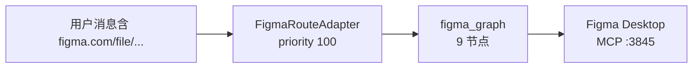
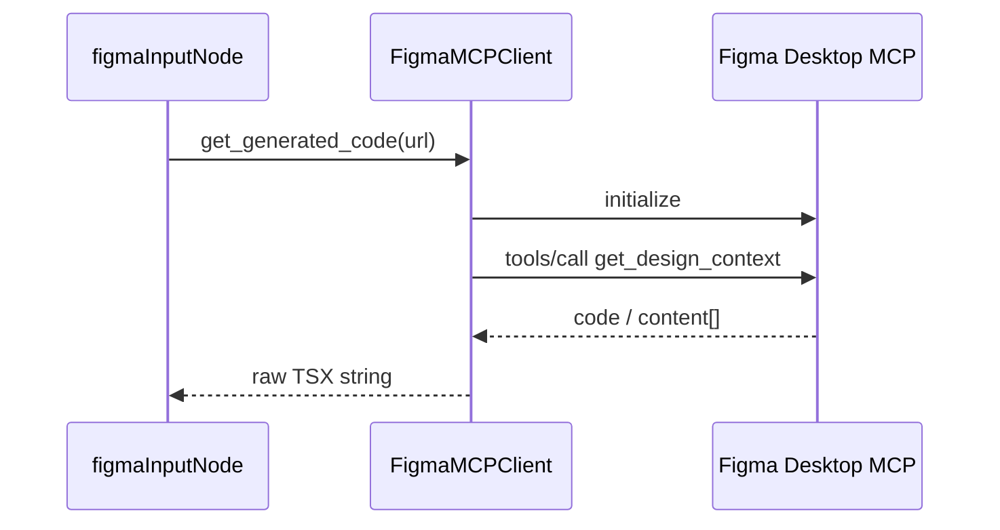

# 6 · Figma 的 MCP 服务

> **前置：** [1. 项目重点概述](../1.项目重点概述/课件.md)（Figma 路由、`figma_graph`）  
> **配套代码：** `完整代码/figma-make/server-py/services/figma/mcp_client.py`、`agents/graphs/figma_graph.py`、`agents/flows/figma_direct/**`、`agents/adapters/figma_adapter.py`  
> **配套素材：** 同目录 `备注.txt`、`figma-demo/`（Cursor + MCP 直连生成的示例前端）  
> **建议时长：** 4～5 课时（环境配置 → MCP Client → 九节点流水线）

---

## 本章学习目标

学完本章，你应该能：

1. 说清 **Figma Desktop MCP** 与后端 `FigmaMCPClient` 的关系，并完成本机连通性验证  
2. 读懂 `initialize` → `tools/call` 的 JSON-RPC 流程，以及 `get_generated_code` 如何抽取 TSX  
3. 理解用户消息里 **Figma URL** 如何触发 `figma-route` 与 `figma_graph`  
4. 对比 **Traditional 19 节点** 与 **Figma 9 节点** 的设计哲学与数据流  
5. 能排查 MCP 连接失败、Tab 不对、SSE payload 为空等常见问题

---

## 一、Figma 流程在系统中的位置



| 对比 | Traditional | Figma |
|------|-------------|-------|
| 输入 | 自然语言需求 | 设计稿 URL（+ 可选文字） |
| 代码来源 | 多节点 LLM 分步生成 | MCP **一次性** 出整页 TSX，再解析拆分 |
| 节点数 | 19 | 9 |
| Mock | 支持逐节点 | **不支持** 逐节点 Mock |

**设计哲学：**

```text
Traditional：从零「想」出来
Figma：先「拿」到代码（MCP），再「拆」干净（解析 + LLM 重构）
```

---

## 二、Figma Desktop MCP 与环境配置

### 2.1 MCP 是什么？

- **运行位置：** Figma **桌面客户端** 内置 MCP Server（非云端 REST API）。  
- **默认地址：** `http://127.0.0.1:3845/mcp`（可用环境变量 `FIGMA_MCP_URL` 覆盖）。  
- **协议：** JSON-RPC 2.0，部分响应为 SSE。  
- **本课程工具：** `get_design_context`（参数 `url` = 设计稿链接）。

后端不实现 Figma API 签名，只作为 **MCP 客户端** 调本地服务。

### 2.2 环境准备清单

| 步骤 | 操作 |
|------|------|
| 1 | 安装 **Figma Desktop** 并登录 |
| 2 | 打开目标 **设计文件**，并保持为 **当前激活 Tab** |
| 3 | 在 Figma 设置中 **启用 MCP Server**（版本需支持 Dev Mode / MCP） |
| 4 | 确认本机 `3845` 端口可访问 |
| 5 | 启动 `server-py`，发送带 Figma 链接的聊天请求 |

**常见错误文案（`figma_input_node` 会识别并抛错）：**

```text
The MCP server is only available if your active tab ...
```

含义：桌面端未打开该文件，或当前 Tab 不是设计画布。

### 2.3 在 Cursor 中配置 MCP（探索用）

`备注.txt` 说明：可用 **Cursor + Figma MCP** 直接生成 `figma-demo/`（Vite + React 示例）。

1. Cursor **Settings → MCP**，URL 指向 `http://127.0.0.1:3845/mcp`。  
2. 确保 Figma Desktop 已启动 MCP。  
3. 在 Agent 对话中粘贴 Figma 链接，调用 `get_design_context` 生成代码。

**与产品后端的关系：** Cursor 内配置用于 **探索/对照**；产品化路径是 **`server-py` 的 `mcp_client.py`** 在 `figmaInputNode` 中自动调用。

### 2.4 本目录 `figma-demo/`

Vite + React 示例（Hero、Header 等），用于对照 MCP **直接生成** 的前端结构。**不是** `server-py` 流水线产物，而是配置 MCP 后的参考 UI。

---

## 三、路由：如何识别 Figma 请求

`FigmaRouteAdapter`（`priority=100`）：

```python
def can_handle(self, context):
    return bool(extract_figma_url(context.get("messages", [])))
```

`extract_figma_url` 从消息中提取 `figma.com/file/...` 或 `design/...` 链接。

`routes/chat.py`：

```python
route_result = await resolve_route_adapter({...})
agent = figma_agent if route_result["flow"] == "figma" else traditional_agent
```

---

## 四、FigmaMCPClient（`mcp_client.py`）

### 4.1 在流水线中的位置



输出 State：`figmaCode`、`codeLength`、`lineCount`。

### 4.2 单例与配置

```python
DEFAULT_FIGMA_MCP_URL = "http://127.0.0.1:3845/mcp"

def get_figma_mcp_client() -> FigmaMCPClient:
    global _client_instance
    if _client_instance is None:
        _client_instance = FigmaMCPClient()
    return _client_instance
```

| 字段 | 作用 |
|------|------|
| `url` | `FIGMA_MCP_URL` 或默认 |
| `_session_id` | 响应头 `mcp-session-id` 回传 |
| `_message_id` | JSON-RPC 递增 id |

**单例原因：** 复用 Session，避免每次请求重新握手。

### 4.3 `_send_request` 核心

```python
payload = {"jsonrpc": "2.0", "id": self._next_id(), "method": method, "params": params}
headers = {"Content-Type": "application/json", "Accept": "application/json, text/event-stream"}
if self._session_id:
    headers["Mcp-Session-Id"] = self._session_id
# httpx timeout=180.0
# content-type 含 text/event-stream → _parse_sse_response
```

| 要点 | 说明 |
|------|------|
| 超时 180s | 大图生成 1～3 分钟 |
| SSE | 按行解析 `data: {...}` |
| 错误 | `data["error"]` → `RuntimeError` |

### 4.4 会话初始化

```python
await self._send_request("initialize", {
    "protocolVersion": "2024-11-05",
    "clientInfo": {"name": "figma-make-server", "version": "1.0.0"},
    "capabilities": {},
})
await self._send_initialized_notification()  # notifications/initialized
```

`get_generated_code` 在首次调用时 **自动 initialize**。

### 4.5 `get_generated_code` 结果归一化

```python
result = await self.call_tool("get_design_context", {"url": figma_url})
```

解析顺序：

1. `dict` → `code` / `content` / `data`  
2. `content` 为 **list** → 拼接每项 `text`  
3. `str` → 直接用  
4. 空 → `ValueError`

### 4.6 `figma_input_node` 业务校验

| 检查 | 目的 |
|------|------|
| 错误模式字符串 | MCP 提示 Tab 不对 |
| `len < 200` 或无 `import`/`<div` | 非代码内容 |
| 空字符串 | 设计稿无效 |

校验失败 **抛错** 终止图（fail-fast，与 postProcess 的 fail-open 不同）。

---

## 五、Figma 九节点流水线

```mermaid
flowchart LR
  IN[figmaInputNode] --> IMG[imageDownloadNode]
  IMG --> AST[astParserNode]
  AST --> BLK[blockExtractNode]
  BLK --> GEO[geometryGroupNode]
  GEO --> NAM[sectionNamingNode]
  NAM --> GEN[componentGenNode]
  GEN --> ASM[assemblyNode]
  ASM --> PP[figmaPostProcessNode]
  PP --> END((END))
```



文件：`agents/graphs/figma_graph.py`

**三段式：**

```text
① 输入 + 图片持久化（确定性）
② 解析切块（确定性：AST、几何聚类）
③ LLM 命名与逐 Section 生成 → 组装 → AST 扫地
```

### 5.1 输入阶段（无 LLM）

| 节点 | 输入 | 输出 State | 核心逻辑 |
|------|------|------------|----------|
| `figmaInputNode` | `figmaUrl` | `figmaCode`, `codeLength`, `lineCount` | MCP `get_design_context` |
| `imageDownloadNode` | `figmaCode` | `figmaCode`（更新） | 抽 `img*` 临时 URL → OSS → 替换 |

### 5.2 解析阶段（确定性）

| 节点 | 输出 | 作用 |
|------|------|------|
| `astParserNode` | `parsedBlocks` | `jsx_parser.parse_tsx_code`：入口组件、顶层 JSX、资源 |
| `blockExtractNode` | `blockExtracts` | 从 className/style 抽块坐标 |
| `geometryGroupNode` | `geometryGroups` | Y 轴聚类 → Section 列表 |

**目标：** 把「一整页 MCP 代码」变成 **带坐标的 Section**，供后续 AI 按块命名、生成。

`geometryGroupNode` 必须在 `blockExtractNode` 之后，因为聚类依赖块级坐标。

### 5.3 重构阶段（LLM）

| 节点 | 输出 | 作用 |
|------|------|------|
| `sectionNamingNode` | `namedSections` | 根据文案/图片语义起组件名 |
| `componentGenNode` | `figmaComponents` | **并行** 为每个 Section 生成独立 `.tsx` |

### 5.4 组装阶段（确定性）

| 节点 | 输出 | 作用 |
|------|------|------|
| `assemblyNode` | `files` | 合并组件、模板、`package.json`、入口 |
| `figmaPostProcessNode` | `files`（可选覆盖） | 与 Traditional 同理念的 Python `fixer` 后处理 |

Figma 流程 **不做** `typeNode` / `planning`，但仍可走 `figmaPostProcessNode` 修 import 与路径。

### 5.5 State 字段地图

| 字段 | 阶段 |
|------|------|
| `figmaUrl`, `messages`, `mockConfig` | 输入 |
| `figmaCode` | MCP + 图片替换后全文 |
| `parsedBlocks`, `blockExtracts`, `geometryGroups` | 解析 |
| `namedSections`, `figmaComponents` | 重构 |
| `files` | 输出 |

---

## 六、SSE 与前端

| 节点 | SSE `type` | handler `key`（配置中） |
|------|------------|-------------------------|
| `figmaInputNode` | `figmaRawCode` | `rawCode` |
| `imageDownloadNode` | `figmaImageProcessed` | `rawCode` |
| `astParserNode` | `figmaAstParsed` | `astParserResult` |
| `assemblyNode` / `figmaPostProcessNode` | `figmaAssembly` | `files` |

**联调注意：** 节点实际写入多为 `figmaCode`、`parsedBlocks` 等，与 handler 的 `key` 可能不一致，导致 **SSE payload 为空**。读代码时以 **节点 `return` 字段** 为准，必要时对齐 `NODE_HANDLERS`（`routes/chat.py`）。

### 6.1 与 Traditional 共享能力

| 能力 | 复用 |
|------|------|
| 路由 | `route_registry` + `figma_adapter` |
| OSS | `utils/oss.py` |
| 依赖扫描 | assembly 内 `scan_dependencies` |
| AST | `figma_post_process_node` / `fixer.py`（见第 5 章） |

---

## 七、联调与日志

### 7.1 成功日志关键字

```text
[Route] Using Figma direct flow
[FigmaInputNode] Calling Figma MCP Server...
[FigmaMCPClient] Connected to Figma MCP Server at http://127.0.0.1:3845/mcp
[FigmaInputNode] Code retrieval successful
```

### 7.2 成功标准

- `figmaCode` 长度通常 **> 数千字符**，含 `import`、`<div` 等。  
- `imageDownloadNode` 能扫到 `const imgXxx = "https://..."` 并替换为 OSS URL。  
- 最终 SSE 出现 `figmaAssembly` / `files`，Sandpack 可预览。

### 7.3 耗时特征

| 阶段 | 典型耗时 |
|------|----------|
| MCP | 1～3 分钟 |
| 图片 OSS | 取决于张数 |
| 解析 | 秒级 |
| componentGen | LLM × Section 数 |

**不适合** 全链路 Mock；适合设计师本机 + 后端同机。

---

## 八、常见问题（FAQ）

| 现象 | 原因 | 处理 |
|------|------|------|
| 连接拒绝 | Figma 未开 / MCP 未启用 / 端口不对 | 检查 3845、桌面端设置 |
| 返回很短文本 | Tab 不对、链接无效 | 激活设计 Tab |
| 超时 | 大图正常 1～3 分钟 | 可调 httpx timeout |
| SSE 无数据 | handler `key` 与 State 不一致 | 对齐 `chat.py` |
| 能否只走 Figma？ | 能 | 消息含 URL 即 `figma-route` |
| 需要 Figma API Token？ | 否 | MCP 走桌面端 |
| 公网服务器部署？ | MCP 在本机 | 通常仅本地/同机开发 |
| 解析失败 | JSX 结构异常 | 查 `astParserNode` 日志 |
| 某 Section 空组件 | 单块 LLM 失败 | 可降级，查 componentGen 日志 |

---

## 九、本章练习（精选）

1. 写一条触发 `figma-route` 的用户消息（含完整 Figma URL）。  
2. 列出 MCP 失败时 `figma_input_node` 应检查的 3 项（Tab、端口、链接）。  
3. 画出 `_send_request` 处理 JSON 与 SSE 的分支。  
4. 若 MCP 返回 `{ "content": [{"text": "import..."}] }`，走哪段解析逻辑？  
5. 画三张表：输入 / 解析 / 重构阶段各有哪些 State 键。  
6. 说明为何 Figma 流程常放在开发者本机而非公网服务器。  
7. Figma 九节点中，哪些不调 LLM？哪些可能并行？

---

## 十、检查清单（本章结业）

- [ ] 能完成 Figma Desktop MCP 启用与 3845 探活  
- [ ] 能说明 `FigmaMCPClient` 单例与 Session 头  
- [ ] 能复述 `get_design_context` 与 `figma_input_node` 校验  
- [ ] 能对比 Traditional 与 Figma 的输入、节点数、代码来源  
- [ ] 能按顺序说出 9 个节点职责  
- [ ] 知道 SSE handler key 可能与 State 字段不一致  
- [ ] 能根据日志判断 MCP 是否真正返回 TSX  

---

## 十一、后续学习路径

| 顺序 | 主题 |
|------|------|
| 7 | [图片上传](../7.%20图片上传/课件.md)（`imageDownloadNode`、OSS、用户上传 API） |
| — | 课程总览 [课件.md](../课件.md) |

---

## 本章小结

```
Figma 的 MCP 服务 = 桌面 MCP（环境）+ FigmaMCPClient（协议）
                 + figma-route（路由）
                 + figma_graph 九节点（拿码 → 图片 → 解析切块 → LLM 重构 → 组装 → AST）

MCP 整页 TSX 是起点，不是终点；解析与分 Section 生成才是可维护的 Sandpack 工程
```

先打通 MCP 与 Client，再对照 `figma_graph.py` 逐节点读日志。
