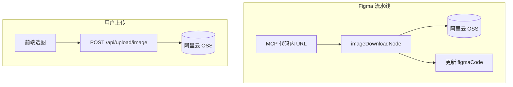

# 7 · 图片上传（Figma 资产 + 用户上传）

> **前置：** [6. Figma 的 MCP 服务](../6.Figma的MCP服务/课件.md)（`imageDownloadNode` 在九节点流水线中）  
> **配套代码：**  
> `agents/flows/figma_direct/input/nodes/image_download_node.py`  
> `routes/upload.py`、`utils/oss.py`、`config/oss.py`  
> **建议时长：** 60～75 分钟

---

## 一、本节学习目标

1. 区分 **两条上传路径**：Figma 流水线自动拉图 vs 用户 `POST /api/upload/image`  
2. 说明 `imageDownloadNode` 四步（抽 URL → 下载 → OSS → 替换）  
3. 配置并理解阿里云 OSS 环境变量  
4. 知道 Sandpack 预览为何需要 **永久 HTTPS URL**  
5. 能排查「图片 403 / 裂开」类问题

---

## 二、为什么要把图片搬上 OSS？

| 来源 | 问题 |
|------|------|
| Figma MCP 生成的 `const imgX = "https://..."` | 临时/鉴权 URL，过期或跨域 |
| 用户聊天附件 | 需稳定 URL 供生成代码 `src` 引用 |

**目标：** 统一为 `https://{bucket}.{endpoint}/images/...` 可公网访问（或桶策略允许读）。



---

## 三、路径 A：`imageDownloadNode`

文件：`image_download_node.py`

### 3.1 提取 URL

正则匹配 MCP 产物：

```python
pattern = r"""(?:export\s+)?const\s+(img\w+)\s*=\s*["']([^"']+)["']\s*;?"""
```

只处理 `http://` / `https://` 字面量。

### 3.2 并行下载

`asyncio.gather` + `httpx` GET，超时 30s；失败项进入 `failed` 列表但不阻断整体。

### 3.3 批量上传

`batch_upload_images_to_oss`（`utils/oss.py`）：按内容 hash 生成路径，返回 `ossUrl`。

### 3.4 替换与变量名归一

- 全文 `replace(old_url, new_url)`  
- `imgImage11` → `img11` 等（`_normalize_asset_var_name`），避免重复定义冲突  

返回：`{"figmaCode": updated_code}`。

### 3.5 降级策略

| 情况 | 行为 |
|------|------|
| 无图片常量 | `return {}`，沿用原 code |
| 下载全失败 | `return {}`，保留 Figma 原链 |
| OSS 异常 | 打印日志，`return {}` |

---

## 四、路径 B：用户上传 API

`routes/upload.py` → `POST /image`（挂载在 `/api/upload` 下，以 `main.py` 为准）。

| 项 | 值 |
|----|-----|
| 允许扩展名 | jpg, jpeg, png, gif, webp, svg |
| 最大体积 | 10MB |
| 对象键 | `images/{YYYYMMDD}-{uuid}{ext}` |
| 响应 | `{ "url", "name" }` |

```python
file_url = f"{protocol}://{bucket}.{endpoint}/{filename}"
```

前端把 `url` 插入消息附件或 Prompt，供 **图片分析 / 生成** 节点使用（Traditional `image_adapter` 路由）。

---

## 五、OSS 配置 `config/oss.py`

环境变量（`.env`）典型项：

```env
ALI_OSS_AK=...
ALI_OSS_SK=...
ALI_OSS_BUCKET=...
ALI_OSS_ENDPOINT=oss-cn-xxx.aliyuncs.com
ALI_OSS_SECURE=true
```

`get_oss_client()` 未完成配置时 **抛错**，上传 API 返回 500。

`upload_image_to_oss` 用 **内容 MD5 前缀 + 时间戳** 防重复上传同名二进制。

---

## 六、与前端协作

| 场景 | 前端行为 |
|------|----------|
| 聊天附图 | 先调 upload API，再把 URL 放进 `messages` |
| Figma 生成 | 无需手传图；后端 `imageDownloadNode` 自动处理 |
| Sandpack 预览 | 代码内 `src` 必须为可加载 HTTPS |

---

## 七、FAQ

| 现象 | 排查 |
|------|------|
| Figma 图仍裂 | OSS 未配、下载失败、未执行 imageDownloadNode |
| 上传 400 | 扩展名/大小 |
| 上传 500 | AK/SK/Bucket |
| 替换数 0 | URL 不在 code 字符串中（编码差异） |
| svg 过大 | 考虑压缩或限制 10MB |

---

## 八、联调日志

```text
[ImageDownloadNode] Found N image links
[ImageDownloadNode] Success: X, Failed: Y
[ImageDownloadNode] Replaced: Z URLs
[Upload] Upload successful: https://...
```

---

## 九、练习

1. 写一条 MCP 代码片段，能被 `_extract_image_urls` 命中。  
2. 对比两条路径生成的 OSS 路径规则差异。  
3. 若 OSS 不可用，Figma 流程还能走到 `astParserNode` 吗？

---

## 十、小结

```
图片 = Figma 临时 URL 或用户文件 → 阿里云 OSS 永久链 → 写回代码或消息

imageDownloadNode：自动化、可降级
upload API：10MB 限制、聊天附件

预览稳定依赖 HTTPS 与桶读权限
```

---

**上一章：** [6. Figma 的 MCP 服务](../6.Figma的MCP服务/课件.md)  
**课程总览：** [课件.md](../课件.md)
