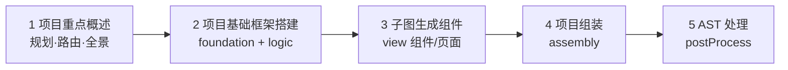
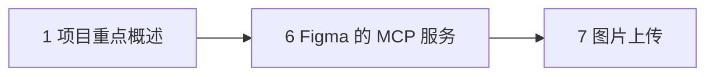

# Coding Agent 课件总览

本目录为 **Zood Figma Make** 后端课程合并版：由原 `01～26` 分册整理为 **6 章主干 + 图片上传 + 结语**，按代码流水线组织，便于按章精读。

**配套工程：** `完整代码/figma-make/server-py`（前端 `frontend/`、模板 `templates/react-ts/`）

---

## 建议学习顺序

### 主线 · Traditional 文本生成（必学）

按 LangGraph 实际执行顺序阅读：



| 顺序 | 章节 | 对应流水线阶段 |
|------|------|----------------|
| 1 | [项目重点概述](1.%20项目重点概述/课件.md) | 入门、规划 7 步、Traditional 19 节点全景 |
| 2 | [项目基础框架搭建](2.%20项目基础框架搭建/课件.md) | dependency → types → utils/mock → service/hooks |
| 3 | [子图生成组件](3.%20子图生成组件/课件.md) | componentSubgraph → pageSubgraph |
| 4 | [项目组装](4.%20项目组装/课件.md) | layout → style → app → assembleNode |
| 5 | [AST 处理](5.%20AST处理/课件.md) | postProcessNode → `fixer.py` |

**预估学时：** 约 25～35 课时（含动手与 curl/SSE 联调）。

### 支线 · Figma 设计稿生成（选学）

依赖第 1 章中的路由与 `figma_graph` 概念，可与主线并行或后学：



| 顺序 | 章节 | 说明 |
|------|------|------|
| 1 | [项目重点概述](1.%20项目重点概述/课件.md) | 含 Figma / Traditional 双路径对比 |
| 6 | [Figma 的 MCP 服务](6.Figma%E7%9A%84MCP%E6%9C%8D%E5%8A%A1/课件.md) | MCP 配置、Client、九节点流水线 |
| 7 | [图片上传](7.%20图片上传/课件.md) | `imageDownloadNode`、OSS、用户上传 API |

**预估学时：** 约 6～8 课时（需本机 Figma Desktop + MCP）。

---

## 章节一览

| 章 | 名称 | 主课件 | 前置 | 建议时长 |
|----|------|--------|------|----------|
| 1 | 项目重点概述 | [课件](1.%20项目重点概述/课件.md) | 无 | 12～16 课时 |
| 2 | 项目基础框架搭建 | [课件](2.%20项目基础框架搭建/课件.md) | 1 | 5～6 课时 |
| 3 | 子图生成组件 | [课件](3.%20子图生成组件/课件.md) | 1、2 | 3～4 课时 |
| 4 | 项目组装 | [课件](4.%20项目组装/课件.md) | 1、2、3 | 1.5～2 课时 |
| 5 | AST 处理 | [课件](5.%20AST处理/课件.md) | 3、4 | 1.5～2 课时 |
| 6 | Figma 的 MCP 服务 | [课件](6.Figma%E7%9A%84MCP%E6%9C%8D%E5%8A%A1/课件.md) | 1 | 4～5 课时 |
| 7 | 图片上传 | [课件](7.%20图片上传/课件.md) | 6 | 1 课时 |
| 8 | 结语 | 见下 | — | 自选 |

---

## 各章说明与配套

### 第 1 章 · 项目重点概述

**主课件：** [1.项目重点概述/课件.md](1.%20项目重点概述/课件.md)

| 内容块 |
|--------|
| 产品全景、全栈架构、Traditional / Figma 两条路径 |
| `.env` 多模型、模板项目、路由适配器 |
| Traditional 五阶段、节点六大模块、防幻觉、Schema |
| 规划 7 步（analysis → dependency） |

**学完可：** 启动 `server-py`、用 curl 看 SSE、说清 19 节点分工。

---

### 第 2 章 · 项目基础框架搭建

**主课件：** [2.项目基础框架搭建/课件.md](2.%20项目基础框架搭建/课件.md)  
**配套素材：** `依赖基座加载.pptx`、`基础建设.pptx`

| 内容块 |
|--------|
| `dependencyNode` + `assembleNode` 依赖两阶段 |
| `typeNode`、`utilsNode`、`mockDataNode` |
| `serviceNode`、`hooksNode` 四层数据访问 |

**学完可：** 读懂 foundation + logic 的 State 滚雪球与 `code` / `content` 字段差异。

---

### 第 3 章 · 子图生成组件

**主课件：** [3.子图生成组件/课件.md](3.%20子图生成组件/课件.md)  
**配套素材：** `子图生成组件.pptx`

| 内容块 |
|--------|
| `componentSubgraph`：`Send` fan-out、`generate_component_node` |
| `pageSubgraph`：`componentsCode` 注入、JSON Prompt |
| Mock 联调、import 排错 |

**学完可：** 解释为何先组件后页面、如何读 `[ComponentGraph]` / `[PageGraph]` 日志。

---

### 第 4 章 · 项目组装

**主课件：** [4.项目组装/课件.md](4.%20项目组装/课件.md)  
**配套素材：** `项目组装.pptx`

| 内容块 |
|--------|
| `layoutNode`、`styleGenNode`、`appGenNode` |
| `assembleNode` 合并顺序、`files` SSE |
| `mergeSandpackFiles` 与 `/src` 镜像 |

**学完可：** 根据 `Categories` 日志判断缺哪类文件、区分两次 `files` 事件（与第 5 章衔接）。

---

### 第 5 章 · AST 处理

**主课件：** [5.AST处理/课件.md](5.%20AST处理/课件.md)

| 内容块 |
|--------|
| `postProcessNode`、`post_process_files` |
| `process_file` 流水线、`@/` → 相对路径 |
| 子图内 `process_generated_code` 与全项目后处理边界 |

**学完可：** 用 `[AST PostProcess]` 判断路径修复是否生效。

---

### 第 6 章 · Figma 的 MCP 服务

**主课件：** [6.Figma的MCP服务/课件.md](6.Figma%E7%9A%84MCP%E6%9C%8D%E5%8A%A1/课件.md)  
**配套素材：** `figma-demo/`、`备注.txt`

| 内容块 |
|--------|
| Figma Desktop MCP（`:3845`）、Cursor 配置参考 |
| `FigmaMCPClient`、`figma-route` |
| `figma_graph` 九节点：MCP → 解析 → LLM 重构 → 组装 |

**学完可：** 本机打通 MCP、对照 `figmaCode` 与九节点日志。

---

### 第 7 章 · 图片上传

**主课件：** [7. 图片上传/课件.md](7.%20图片上传/课件.md)

| 内容块 |
|--------|
| `imageDownloadNode`（Figma 临时 URL → OSS） |
| `POST /api/upload/image`（用户附件） |
| 阿里云 OSS 环境变量与预览稳定性 |

**学完可：** 配置 OSS、排查图片 403 / 裂开。

---

### 第 8 章 · 结语

| 资料 | 路径 |
|------|------|
| 简历 · 项目经历 | [8. 结语/01. 关于简历，我想说的/项目经历.md](8.%20%E7%BB%93%E8%AF%AD/01.%20%E5%85%B3%E4%BA%8E%E7%AE%80%E5%8E%86%EF%BC%8C%E6%88%91%E6%83%B3%E8%AF%B4%E7%9A%84/%E9%A1%B9%E7%9B%AE%E7%BB%8F%E5%8E%86.md) |
| 面试讲解 | [8. 结语/02. 关于面试，我想说的/面试讲解.md](8.%20%E7%BB%93%E8%AF%AD/02.%20%E5%85%B3%E4%BA%8E%E9%9D%A2%E8%AF%95%EF%BC%8C%E6%88%91%E6%83%B3%E8%AF%B4%E7%9A%84/%E9%9D%A2%E8%AF%95%E8%AE%B2%E8%A7%A3.md) |

---

## Traditional 节点与章节对照

便于查代码时跳转课件：

| 流水线阶段 | 代表节点 | 主要章节 |
|------------|----------|----------|
| planning | analysis → dependency | 1 |
| foundation | type → utils → mockData | 2 |
| logic | service → hooks | 2 |
| view | componentSubgraph → pageSubgraph → layout → style | 3、4 |
| assembly | appGen → assembleNode | 4 |
| postProcess | postProcessNode | 5 |

---

## 延伸阅读

仓库 **`02. 后端架构/`** 仍保留分专题讲义（Mock 设计、部分未并入主干的细节），与本书 **1～7 章** 互补：

| 主题 | 说明 |
|------|------|
| Mock 设计 | `02. 后端架构/22. mock设计/` 等 |
| 分节点深挖 | 与合并章同主题时可对照源码 |

---

## 快速启动（复习用）

```bash
cd 完整代码/figma-make/server-py
cp .env.example .env   # 配置 DEEPSEEK_API_KEY 等
uv sync && uv run uvicorn main:app --reload --port 7001
```

```bash
# 闲聊短路
curl -sN -X POST http://localhost:7001/api/chat/ \
  -H "Content-Type: application/json" \
  -d '{"messages":[{"role":"user","content":"hi"}]}'

# 完整 Traditional 生成
curl -sN -X POST http://localhost:7001/api/chat/ \
  -H "Content-Type: application/json" \
  -d '{"messages":[{"role":"user","content":"做一个待办应用"}]}'
```

更多 Demo 与 Mock 示例见 [第 1 章](1.%20项目重点概述/课件.md)。
